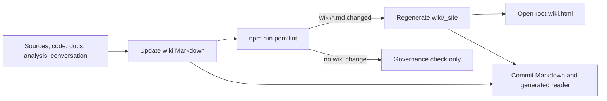

# POM - Project Operating Memory

**POM** is a lightweight method for keeping a project's operating memory alive by connecting sources, code, mockups, wiki pages, decisions, verifiable tasks, roadmap context, and official documentation.

This README is POM's canonical entry point and operating overview. Detailed procedures live in the repository's canonical files: `AGENTS.MD`, `skills/`, `prompts/`, `templates/`, and `scripts/`.

POM is designed to be reused on new or existing projects. It does not impose a single application structure and does not assume that every project has mockups, source code, tests, or official docs. For existing projects, POM should first map the current structure in `pom.config.json`; migration to canonical folders is a later explicit decision, not a prerequisite.

Version: `0.1.0`

Release notes: see `CHANGELOG.md`.

## Credits

POM - Project Operating Memory is created and maintained by **Fabio Malpezzi**.

Website: <https://www.improveandmanage.com/>

Special thanks to **Andrej Karpathy** for the LLM Wiki pattern that inspired POM's persistent wiki approach.

## Readable Guides

For a reader-friendly explanation of POM's purpose, tools, adoption levels, skills, and recommendations, see:

- [POM Guide in English](docs/POM_GUIDE.en.html)
- [Guida POM in italiano](docs/POM_GUIDE.it.html)
- [POM Wiki Reader](wiki.html)

These guides are explanatory or generated reader views, not normative replacements. Operational rules remain in `README.md`, `AGENTS.MD`, `prompts/`, `skills/`, `templates/`, `scripts/`, and the source Markdown under `wiki/`.

## Quickstart

Use the smallest workflow that matches your situation:

| Situation | Start Here |
|---|---|
| Ambiguous request or artifact | `skills/clarify.md` |
| New project | `skills/seed.md` |
| Existing project | `skills/adopt.md` |
| External repository you do not own | Overlay mode in `specs/SPEC-0004-external-project-overlay.md` |
| Resume after a pause | `skills/pulse.md` |
| Ask or maintain the wiki | `skills/wiki.md` |
| Render the wiki reader | `npm run pom:wiki:render` |
| Extend POM | `skills/extend.md` |
| Reduce method bloat | `skills/prune.md` |
| Diagnose a POM problem | `skills/diagnose.md` |
| Rework a patch around the intended final shape | `skills/zero-tech-debt.md` |
| Challenge a spec or decision before closure | `skills/challenge.md` |
| Defer work without implementing | `skills/defer.md` |
| Refresh or sync POM in a project | `skills/sync.md` |
| See available commands | `npm run pom:help` |

### How to talk to the agent

Once POM is installed, tell the agent what you need. The agent reads the skill card, then the linked prompt, then the relevant templates.

```text
# Bootstrap a new project
Read pom/skills/seed.md and set up POM for this project.

# Build the wiki from existing sources
Read pom/skills/wiki.md in build mode and create the wiki.

# Generate the static wiki reader
npm run pom:wiki:render

# Open the static wiki reader
wiki.html

# Resume after a pause
Read pom/skills/pulse.md and update PROJECT_STATE.md.

# Turn a spec into tasks
Read pom/skills/plan.md and create a task plan from specs/my-feature.md.

# Defer future work
Read pom/skills/defer.md and park this topic without implementing it.

# Rework a patch around the intended final shape
Read pom/skills/zero-tech-debt.md and reshape the current change before closure.

# Challenge a non-code spec or decision
Read pom/skills/challenge.md and run an adversarial thesis/antithesis review of specs/my-feature.md.

# End-of-session handoff
Read pom/skills/handoff.md and update the project state.
```

See `examples/agent-conversations.md` for more detailed interaction examples.

## Installation

**Requirements:** Node.js ≥22.6 (for TypeScript script execution via `--experimental-strip-types`). Git required.

### First install (recommended)

Download and run the bootstrap script from the target project root:

```bash
curl -fsSL https://raw.githubusercontent.com/FabioMalpezzi/pom/main/bootstrap-pom.mjs -o bootstrap-pom.mjs
node bootstrap-pom.mjs --preset owned
```

Do not install POM by running `git clone https://github.com/FabioMalpezzi/pom.git .` in a project root. This repository is the POM Source. The bootstrap is the supported install path because it keeps the reusable method under `pom/` and leaves project-owned files at the target project root.

If your goal is to improve POM itself, clone this repository as its own working repository and do not run the bootstrap. Use the source repository commands such as `npm run pom:lint`, `npm run pom:test`, and `npm run pom:wiki:render`.

When asking an AI agent to install this method, say `POM - Project Operating Memory from FabioMalpezzi/pom` and ask it to run the bootstrap from the target project root. That wording distinguishes POM from Maven `pom.xml`, Page Object Model, and other common meanings.

Suggested AI-agent prompt:

```text
Install POM - Project Operating Memory from https://github.com/FabioMalpezzi/pom in this target project. Treat that repository's README as the installation authority for this turn. Fetch or read the README first, then follow its Installation section. Do not use Maven, Page Object Model, or a remembered POM workflow. Do not clone the repository into the project root; use the bootstrap from the target project root. If I have not stated a preset, ask me to choose one of owned, team, overlay, or minimal.
```

If you already know the preset, include it in the prompt, for example: `Use preset owned.`

Do not pipe a remote bootstrap script directly into `node`. Download it first, then inspect it or verify it before running.

For environments that require a pinned and checked install, prefer a tag or commit URL and verify the bootstrap checksum before execution:

```bash
POM_REF=main
curl -fsSL "https://raw.githubusercontent.com/FabioMalpezzi/pom/${POM_REF}/bootstrap-pom.mjs" -o bootstrap-pom.mjs
curl -fsSL "https://raw.githubusercontent.com/FabioMalpezzi/pom/${POM_REF}/checksums/bootstrap-pom.mjs.sha256" -o bootstrap-pom.mjs.sha256
shasum -a 256 -c bootstrap-pom.mjs.sha256
node bootstrap-pom.mjs --preset owned
```

Use `main` only when you intentionally want the current development line. For repeatable adoption, set `POM_REF` to a release tag or immutable commit and use the checksum published with that same ref.

Choose the preset that matches your relationship to the repository:

| Preset | Use when | Meaning |
|---|---|---|
| `owned` | The project is yours | POM may become project governance when useful. |
| `team` | The project is shared with a team | POM must preserve shared conventions unless explicitly changed. |
| `overlay` | The repository belongs to an external upstream | POM is local understanding memory only. |
| `minimal` | You want only the smallest local setup | POM starts with minimal memory and no ownership assumption. |

Running `bootstrap-pom.mjs` without a preset prints this guide and exits. POM does not guess ownership during first install.

Use `--lang it|en` only when you want to force the language of CLI guidance.

After bootstrap has installed `pom/`, for agent-driven setup on a new project, ask:

```text
Read pom/skills/seed.md and set up POM for this project.
```

After bootstrap has installed `pom/`, for agent-driven adoption in an existing repository, ask:

```text
Read pom/skills/adopt.md and adopt POM without changing the existing structure.
```

For a cloned repository you do not own, prefer overlay mode:

```bash
node bootstrap-pom.mjs --preset overlay
```

Then ask the agent to read the overlay rules before adding project memory:

```text
Read pom/specs/SPEC-0004-external-project-overlay.md and use POM as a local understanding overlay, not as project governance.
```

In overlay mode, POM governs the operator's understanding of the project. It must not impose POM conventions on upstream `docs/`, `tests/`, ADRs, source layout, release process, or pull-request contents.

The bootstrap script:

- clones POM into `pom/` (or pulls if it already exists);
- runs the installer using the selected preset;
- initializes Git in the target project root when the target is not already inside a Git worktree;
- lets advanced users choose an adoption profile directly (minimal, wiki, decisions, full, adopt, refresh, custom);
- updates the POM section in every existing supported agent instruction file, or creates `AGENTS.md` if none exists;
- creates `package.json` scripts, `pom-update.mjs`, `pom.config.json`, and governance folders based on the chosen profile.
- installs or updates the Git pre-commit hook with POM checks when the target project root is the Git worktree root.

You can also pass a profile directly for advanced use:

```bash
node bootstrap-pom.mjs --profile full
```

For existing repositories, the presets are the normal path:

```bash
node bootstrap-pom.mjs --preset owned
node bootstrap-pom.mjs --preset team
node bootstrap-pom.mjs --preset overlay
```

You can still pass ownership explicitly when the agent or user already knows the relationship:

```bash
node bootstrap-pom.mjs --profile adopt --ownership owned
node bootstrap-pom.mjs --profile adopt --ownership team
node bootstrap-pom.mjs --profile adopt --ownership external_overlay
```

The same option is available after POM is installed:

```bash
npm run pom:init -- --preset overlay
```

### Updating POM in an existing project

For normal manual updates from a project that already has POM installed:

```bash
npm run pom:update
git diff
```

`pom:update` updates `pom/`, refreshes the POM section in every existing supported agent instruction file, updates package scripts and the pre-commit hook, then runs `pom:lint` when available. It supports both Git-managed POM installs and clean vendored `pom/` copies. It does not change `pom.config.json`, project documents, wiki, decisions, or project-owned templates outside `pom/`.

`pom:update` also does not change adoption mode. If called with `--preset`, `--profile`, or `--ownership`, it stops and tells you to use `pom:init` instead. Changing mode is a governance decision, not a framework update.

If `pom/` has local changes, `pom:update` stops and suggests `pom/skills/sync.md` instead of overwriting them. For vendored copies, unrelated parent-project changes outside `pom/` do not block the update.

For agent-driven updates, use the sync skill:

```text
Read pom/skills/sync.md and refresh this project's POM installation.
```

If the project does not have `pom:update` yet, install the current updater once:

```bash
curl -fsSL https://raw.githubusercontent.com/FabioMalpezzi/pom/main/bootstrap-pom.mjs -o bootstrap-pom.mjs
node bootstrap-pom.mjs --profile refresh
```

If POM is already installed, `pom/` is clean, and `package.json` has the scripts, you can also refresh only generated sections with:

```bash
npm run pom:init -- --profile refresh
```

That command is an advanced convenience path. It does not replace `pom:update` when POM itself may need to be pulled first.

After installation, show the command guide with:

```bash
npm run pom:help
```

Prints the command reference and skill index. Always exits immediately — no interactive input required.

Supported instruction targets are deliberately conservative:

- existing root files: `AGENTS.md`, `AGENTS.MD`, `agents.md`, `CLAUDE.md`, `GEMINI.md`, `CONVENTIONS.md`, `.cursorrules`, `.clinerules`, `.windsurfrules`;
- existing nested files: `.github/copilot-instructions.md`, `.junie/guidelines.md`, `.junie/instructions.md`, `.junie/AGENTS.md`;
- existing rule folders, where POM creates or updates a dedicated file: `.claude/rules/pom.md`, `.github/instructions/pom.instructions.md`, `.cursor/rules/pom.mdc`, `.windsurf/rules/pom.md`, `.kiro/steering/pom.md`, `.continue/rules/pom.md`, `.roo/rules/pom.md`, `.clinerules/pom.md`.

POM does not create tool-specific folders just because the tool exists. It only writes into a tool-specific folder when that folder is already part of the project.

For Claude Code, `.claude/agents/pom-post-action-validator.md` is optional. The installer creates or updates it only when `.claude/` already exists. If `.claude/` is missing, the installer prints the exact `mkdir -p .claude` and `npm run pom:init ...` commands to enable the helper with the same install mode.

### External project overlay

Use overlay mode when the repository is cloned from an upstream you do not own and POM is needed to understand, audit, or prepare a limited contribution.

Overlay mode is different from adoption:

| Mode | What POM governs |
|---|---|
| Adoption | the project's operating method |
| Overlay | the operator's local understanding of someone else's project |

Overlay mode should keep upstream structures authoritative:

- upstream `docs/` remain upstream documentation, not POM-governed docs;
- upstream `tests/` remain upstream test layout, not POM-governed test structure;
- upstream agent instruction files should be preserved unless local agent guidance is intentionally added;
- local wiki pages are working notes for understanding architecture, entrypoints, modules, tests, conventions, risks, and open questions;
- before opening a PR, POM overlay artifacts must stay out of the contribution unless the upstream project explicitly wants them.

Recommended Git posture:

- keep the overlay in its own branch or, better, in a separate Git worktree;
- do actual upstream contribution work on a separate feature branch;
- do not merge the overlay branch into the contribution branch;
- transfer only selected non-POM changes with a patch, file checkout, or `git cherry-pick -n` of commits that contain no POM artifacts.

See `specs/SPEC-0004-external-project-overlay.md` for the documented mode and future implementation requirements.

If you customized or translated templates, keep them outside `pom/` before refreshing, for example:

```text
project-templates/
  ADR_TEMPLATE.md
  WIKI_PAGE_TEMPLATE.md
  PROJECT_STATE_TEMPLATE.md
```

Then point `pom.config.json` to those project-owned templates:

```json
"templates": {
  "adr": "project-templates/ADR_TEMPLATE.md",
  "wikiPage": "project-templates/WIKI_PAGE_TEMPLATE.md",
  "projectState": "project-templates/PROJECT_STATE_TEMPLATE.md"
}
```

Template paths in `pom.config.json` are relative to the target project root, where `pom.config.json`, agent instruction files, `package.json`, and `pom/` live. For example, `project-templates/ADR_TEMPLATE.md` means `<project-root>/project-templates/ADR_TEMPLATE.md`, not `<project-root>/pom/project-templates/ADR_TEMPLATE.md`.

Do not customize files directly under `pom/`: updates may overwrite them or create Git conflicts.

The bootstrap itself requires only Node ≥20. The installer it launches requires Node ≥22.6.

### Manual install

**Important:** POM must live in a subfolder (typically `pom/`), not at the project root. Cloning POM directly into the root would overwrite the project's `README.md`, `AGENTS.MD`, and `package.json`, and break all internal path references.

```bash
# Option A: Git submodule (stays updatable)
git submodule add https://github.com/FabioMalpezzi/pom.git pom

# Option B: Simple copy
cp -r /path/to/pom ./pom
```

Then run the installer:

```bash
node --experimental-strip-types pom/scripts/install-pom.ts
```

### Project structure after installation

In the common Git-managed install, `pom/` is a full checkout of the POM Source and may contain its own `.git`, `README.md`, `AGENTS.MD`, `bootstrap-pom.mjs`, and `package.json`. That is expected. The wrong layout is POM Source files directly at the target project root.

On a new project, the root may initially contain only `pom/`, agent instructions, `package.json`, `pom-update.mjs`, and `pom.config.json`. That is a valid day-zero state: create `PROJECT_STATE.md`, `CURRENT_PLAN.md`, `tasks/`, `analysis/`, `docs/`, `wiki/`, or the configured decisions root only when the selected adoption profile enables them or current work needs them.

If a new project has no application infrastructure yet, POM must not infer the stack, source layout, package manager, deployment model, database, authentication system, test framework, or hosting strategy on its own. Treat infrastructure as a project decision: ask the user how they want it realized, or create an approved Open Discussion or analysis note for the alternatives, before scaffolding code or committing to a technical structure.

```text
my-project/
  pom/                  <- POM method (this repository)
    .git/               <- present in Git-managed installs
    prompts/
    skills/
    templates/
    scripts/
  AGENTS.md             <- project agent instructions, when used (references pom/)
  CLAUDE.md             <- also updated when already present
  pom.config.json       <- project-specific config
  wiki.html             <- shortcut to the generated wiki reader, if wiki profile enabled
  wiki/                 <- if wiki profile enabled
  decisions/            <- default decisions root, if decisions profile enabled
  ...
```

### Non-npm projects

If the project does not use npm, copy the POM section manually into every agent instruction file used by the project:

| Agent | Instructions file | What to do |
|---|---|---|
| OpenAI Codex | `AGENTS.md` | Copy `pom/templates/AGENTS_POM_SECTION_TEMPLATE.md` into `AGENTS.md` |
| Claude Code | `CLAUDE.md` | Copy `pom/templates/AGENTS_POM_SECTION_TEMPLATE.md` into `CLAUDE.md` |
| Gemini | `GEMINI.md` | Copy `pom/templates/AGENTS_POM_SECTION_TEMPLATE.md` into `GEMINI.md` |
| GitHub Copilot | `.github/copilot-instructions.md` or `.github/instructions/pom.instructions.md` | Copy the template content into the project instructions |
| Cursor | `.cursor/rules/pom.mdc` or `.cursorrules` | Copy the template content into a project rule |
| Windsurf | `.windsurf/rules/pom.md`, `.windsurfrules`, or `AGENTS.md` | Copy the template content into a project rule |
| Kiro | `.kiro/steering/pom.md` | Copy the template content as a steering file |
| Junie | `.junie/AGENTS.md` or `.junie/guidelines.md` | Copy the template content into the project guidelines |
| Cline / Roo / Continue | tool-specific rules file or folder | Copy the template content into a POM-specific rule file |
| Other agents | Agent-specific config | Adapt the template to the agent's instructions format |

### Start working

Use the skill that matches your situation (see Quickstart table above). The agent will read the skill card, then the linked prompt, then the relevant templates.

### Pre-commit hook

`pom:init` initializes Git in the target project root when the target is not already inside a Git worktree. When the target project root is the Git worktree root, it installs a managed POM block in the resolved Git `pre-commit` hook path.

If the target project is a subdirectory inside a larger Git worktree, `pom:init` does not create a nested repository and does not install a hook automatically. Install POM from the Git root, or adapt the hook manually so it runs the target project's `npm run pom:lint` from the correct directory.

The hook:

- runs `npm run pom:lint`;
- blocks the commit if lint fails;
- if `PROJECT_STATE.md` exists and governed project-memory files are staged, prints a non-blocking reminder to update it when the restart context changed.

The hook does not synthesize or rewrite `PROJECT_STATE.md`: that remains the agent's responsibility, because it requires project understanding.

Update `PROJECT_STATE.md` when the project restart context changes:

- substantial ADR change;
- substantial spec change;
- roadmap, priority, dependency, or current-plan change;
- important task/phase closed;
- new relevant risk, blocker, or open decision;
- explicit end-of-session or end-of-day handoff request.

Do not update it for typo fixes, regenerated indexes, small link fixes, or changes that do not affect how the next session should restart.

## Origin And Attribution

POM's wiki model is inspired by Andrej Karpathy's **LLM Wiki** pattern, published in the `karpathy/llm-wiki.md` gist:

```text
https://gist.github.com/karpathy/442a6bf555914893e9891c11519de94f
```

The local reference copy of the method is in `WIKI_METHOD.md`.

The gist describes a Markdown wiki maintained incrementally by an LLM, with raw sources, wiki pages, an operating schema, ingest/query/lint operations, an index, and a log.

## Language Policy

POM is documented in English for portability.

When applying POM to a project, the agent must use the project/user language for:

- conversation;
- generated documentation;
- wiki pages;
- ADRs;
- task plans;
- project state;
- reports.

If the project already has a dominant documentation language, follow it. If the user asks for a different language, follow the user. If sources are multilingual, preserve source titles and quoted terms, but write synthesis in the project/user language.

## Installation Model

This repository has its own `AGENTS.MD`. That file governs work on the POM repository itself. Do not copy it verbatim into target projects.

For a target project, use `pom/templates/AGENTS_POM_SECTION_TEMPLATE.md` as the source for the project's agent instructions. The installer updates every existing supported agent instruction target so different coding agents see the same POM rules. If none exists, it creates `AGENTS.md`.

Supported installation styles:

- copy POM into the target project as a `pom/` folder;
- add POM as a Git submodule or subtree under `pom/`;
- keep POM as an external reference and copy only the needed templates/prompts.

`pom/templates/POM_CONFIG_TEMPLATE.json` assumes the common installation style where POM lives in the target project as `pom/`, so template paths point to `pom/templates/...`. If you install POM somewhere else, adapt those paths in the target project's `pom.config.json`.

## Principle

POM does not use one universal source of truth. It uses source authority by domain:

| Question | Authoritative Source |
|---|---|
| What does the system currently do? | code and tests, when present |
| What do we currently know about the project? | `wiki/` |
| Why did we decide this? | configured decisions root (`decisions.root`, default `decisions/`) |
| What analysis supports or challenges a choice? | `analysis/` |
| What is still desiderata, hypotheses, or unresolved discussion? | Open Discussion or `analysis/`, not implementation authority |
| What does the intended experience show? | `mockups/`, when present |
| What can be shared as official documentation? | `docs/`, when present |
| Where do I restart after a pause? | `PROJECT_STATE.md` or current plan |

When sources diverge, the divergence must not be hidden. It must be made visible, analyzed, and resolved with a decision when needed.

## Artifact Policy

POM separates source authority from edit permission. Before changing a governed artifact, check project config or the file itself: `editable` may be changed directly when the source authority supports it; `approvalRequired` needs explicit user approval; `generated` must be regenerated from its source; `historical` should not be rewritten after closure.

## Operating Discipline

Five operating rules apply to every project that uses POM, independently of the adoption profile. They are also reproduced in `AGENTS.md` so the agent reads them at start of session.

### Communication Style With The User

Rules for chat messages to the user.

- **Use the user's language naturally.** No hybrid forms when an idiomatic phrase exists.
- **Project labels are codes, not words.** Administrative labels (spec numbers, ADR identifiers, decision IDs, phase numbers) are archive codes. On first occurrence in the turn, state in plain words what the label refers to. Do not chain more than two such labels in a single sentence. Do not let the label replace the noun ("decide what to do with the finalizers", not "close D10.4").
- **No abstract placeholders.** Forbidden in chat: "I created file X that does Y", "apply rule Z to field W". Real names go in full. Placeholders only in code or formal templates.
- **Summaries in full sentences.** End-of-task recaps describe what was done and what is still open in normal sentences, not in stacks of acronyms.

### Documentation Discipline

Project documentation must stay lean and load-bearing. Its history lives in Git, not in the document text.

- **Update before creating.** If an existing document covers the topic, rewrite it instead of adding a new parallel one. Version history is in Git.
- **No project log inside the docs.** Specs, ADRs, task plans and wikis describe current state and live decisions, not the chronicle of edits. The chronicle lives in Git.
- **If a project log is needed, create it explicitly.** Dedicated file, short entries "date + document + one-line change". Adopting it is an explicit choice taken with the user.
- **Fewer documents, more consistency.** Before creating a new document, check whether the content fits in an existing one.
- **Optimize for the next safe step.** When the right document is unclear, write the smallest useful note where the next reader or agent will need it before acting.

### Work From Sources, Not From Memory

Design and analysis must rely on the current state of code and documents, never on a recollection of them.

- **Read before designing.** Open the actual file before proposing changes, summarizing behavior, or referencing decisions.
- **Use the domain glossary.** Read `CONTEXT.md` before design, refactoring, or governance changes, and use its terms in new prompts, templates, specs, and code comments.
- **Verify before citing.** A note or memory saying "X exists" or "spec Y says Z" is a claim to verify against the repository, not a fact.
- **Declare gaps.** If the artifact you expected cannot be found, say so. Do not fill the gap with assumptions.
- **No reconstruction from memory.** Describing the current content or behavior of a file requires reading it now.

### File Size And Static Analysis

Source files should remain readable and verifiable by automated tooling. POM enforces a structural limit on file size; surrounding tooling is recommended, not imposed.

- **Hard cap at 1000 lines.** No code file should exceed 1000 lines. Above that, split it along a natural seam. This is a POM rule.
- **Aim for under 800.** Treat 800 lines as the working target.
- **Cap applies to hand-written source.** Generated code, large fixtures, and data dumps are exempt.
- **Recommended: configure a linter.** POM does not bundle one. Target projects are encouraged to add a language-appropriate linter and run it as part of the routine cycle.
- **Recommended: configure a type checker.** When the language and environment support it, target projects are encouraged to add a type checker alongside the linter.

### Complexity Standards

Code complexity should stay within the conventions of the language and the architecture chosen for the project. POM proposes the guardrails below; the target project owns their installation and threshold tuning.

- **Recommended: configure a complexity checker.** Suggested tools include ESLint `complexity`/`sonarjs`, `gocyclo`, `radon`, `pmd`, `checkstyle`. When adopted, prefer binding thresholds over advisory ones so they actually shape merges.
- **Architectural boundaries are limits too.** When the project adopts a style (layered, hexagonal, clean, MVC), respect its layer boundaries, allowed dependencies, and module sizes.
- **Refactor before exception.** When a unit crosses the threshold, split it before merging. Bypassing the limit requires an explicit decision recorded in an ADR.
- **Tests are not exempt.** Excessive complexity in tests indicates a design problem in the code; address the cause.

### Continuous Integration

CI is optional. POM runs entirely on local commands and the pre-commit hook; nothing breaks if a project never sets up a remote pipeline. When the target project does want CI, see `pom/templates/CI_GUIDE_TEMPLATE.md` for provider-agnostic snippets (GitHub Actions, GitLab CI, CircleCI, generic shell). POM does not install or generate workflow files; the template is a starting point the project copies and adapts.

## Git And History

POM assumes Git as an operational prerequisite when the project must be governed over time.

Rules:

- Git keeps fine-grained history for specs, ADRs, wiki pages, and code;
- do not duplicate detailed history inside ADRs, specs, or `PROJECT_STATE.md`;
- check `git status` before major reorganizations;
- if the project is not under Git, initialize Git before applying POM structurally; the installer does this automatically during setup;
- after structural changes, run available lint/tests and create a descriptive commit.

### Branching Policy

Specs, task plans, ADRs, wiki pages, and other documentation can be committed directly to the main branch. They are governed documents, not executable code, and do not risk breaking the build.

Create a feature branch (`feat/<topic>`) only when the first task plan step modifies executable code, configuration, prompts consumed at runtime, or test fixtures. The branch isolates changes that could break the build or alter runtime behavior.

| Artifact | Branch needed? |
|---|---|
| Spec, task plan, ADR, wiki page, analysis | No — commit on main |
| Source code, runtime config, prompts, test fixtures | Yes — feature branch |
| Experiment or spike | Yes — `exp/<topic>` or temporary branch |

## ADR And Spec Changes

Specs are living documents: edit them directly and let Git keep fine-grained history.

ADRs represent decisions. If a decision changes substantially, do not simply rewrite the previous ADR. Create a new ADR that supersedes or replaces it, or update the existing ADR only when the change is administrative.
Use Open Discussion or analysis for undecided alternatives; do not create Draft ADRs for options that have not been chosen.

Rules:

- minor spec/ADR change: edit directly + Git;
- substantial spec change: update the spec and evaluate tasks/review;
- changed decision: create a new or replacement ADR;
- do not maintain manual changelogs inside specs/ADRs unless explicitly requested;
- every ADR should expose `Category` and `Area` in the opening metadata table;
- lint generates an ADR index from those metadata fields as a search/navigation view, not as a second source of truth;
- do not introduce workflow states in ADRs: if a document is in the configured decisions root, it is a valid decision; replacements are handled through `Replaces` and `Replaced by`.

## Temporary Experiments

Experiments must remain separate from the stable codebase until evaluated. Use branch `exp/<topic>`, `/tmp`, or `experiments/<topic>/` depending on the case. Consolidate only after evaluation.

For risky or broad experiments, prefer a Git worktree on an `exp/<topic>` branch so the main working tree stays clean. Keep trial dependencies, environment files, service config, generated output, and external repositories isolated from stable source unless adoption is approved. Stable source must not import from `experiments/`; use lint/type/build guardrails where the project already has them.

See `prompts/09-run-temporary-experiment.md` for the full workflow.

## Persistent Wiki

POM treats the wiki as a persistent, cumulative artifact, not a temporary RAG index. The agent should not rediscover everything from scratch on every question: it should maintain structured, interlinked, current knowledge.

Rules:

- the wiki contains the current synthesis, not the full history of decisions;
- sources, code, mockups, and analysis feed the wiki;
- the configured decisions root keeps decision rationale and decision history;
- `wiki/index.md` is the content map;
- `wiki/log.md` is the append-only chronological register and is not rendered as a reader page;
- `npm run pom:wiki:render` generates `wiki/_site/` as a static reader view;
- `wiki.html` at the project root is the stable human shortcut to the generated reader when the wiki is enabled, and explains how to enable or generate the wiki when the reader is missing;
- a useful answer or analysis can become a new wiki page;
- every relevant update should check contradictions, stale claims, missing links, and orphan pages.

The generated reader is derived output. It is useful for browsing and search, but Markdown remains the canonical Operating Memory. `pom:lint` regenerates `wiki/_site/` at the end only when Git reports changed Markdown pages under `wiki/`; `npm run pom:wiki:render` remains available for explicit regeneration.

Wiki pages may define optional YAML frontmatter with `navTitle` when the H1 is too long for reader navigation. The reader uses `navTitle` in side navigation, breadcrumbs, and previous/next links, while keeping the full H1 as the page title and search text. Omit `navTitle` when the H1 is already short enough.

Mermaid rendering is opt-in. By default, the generated reader does not load Mermaid or any external CDN; it shows Mermaid blocks as readable source. If a project passes `--mermaid-runtime` with a remote URL, the generated reader will fetch that module in the browser. Offline or sensitive environments should use no runtime or a local vendored runtime. POM does not add Subresource Integrity for remote Mermaid modules.

### Wiki Reader Lifecycle



Operational rules:

- edit `wiki/*.md`, not `wiki/_site/*.html`;
- run `npm run pom:lint` after wiki changes;
- let lint regenerate `wiki/_site/` when Git reports changed wiki Markdown;
- use `npm run pom:wiki:render` when an explicit reader refresh is needed;
- commit Markdown and regenerated reader output together when the reader output is tracked.

## Operating Cycle

```text
Inputs / Code / Mockups / Analysis / Conversation
        -> Wiki
        -> Decisions
        -> Delivery Plan
        -> Docs
        -> Project State
```

## POM Minimal

Small projects can start with a minimal POM setup. Mockups, official docs, structured tests, and extended lint are not required at the beginning.

Recommended minimum:

```text
agent instruction file or rule
PROJECT_STATE.md
wiki/index.md
wiki/log.md
configured decisions root (default `decisions/`)
optional pom.config.json
```

Rules:

- use `skills/seed.md` for a new project or `skills/adopt.md` for an existing project;
- create only the directories that are actually useful;
- use `PROJECT_STATE.md` as restart memory;
- use `wiki/` only when there is knowledge worth maintaining over time;
- use ADRs only for decisions that change direction or constrain the project;
- add lint, mockups, docs, tests, or an extended roadmap when the project grows.

## Work Planning Hierarchy

The hierarchy is logical, not physical. It organizes work, not folders. Verification happens at every level, not only at the bottom.

For small projects, use the short form:

```text
Task       (closes with integration tests / single-feature E2E)
  -> Step  (closes with atomic verification: unit test, lint, check)
```

For larger or multi-stream projects, use the full hierarchy:

```text
Roadmap
  -> Phase          (closes with acceptance review)
    -> Workstream   (closes with cross-functional E2E / user-flow tests)
      -> Task       (closes with integration tests / single-feature E2E)
        -> Step     (closes with atomic verification: unit test, lint, check)
```

Place E2E and user-flow tests at Task or Workstream level, not at Step level. Step-level verification covers atomic checks only.

Use `Roadmap` only when the project needs multi-phase direction or coordination across multiple streams. Do not force all levels into small work items.

## Completion Verification Rules

A spec, task, or ADR cannot be marked Complete/Accepted without passing the completion verification gate. This gate is **mandatory and automatic**: the agent executes it when marking work as Complete, without asking.

**Verification procedure:**

1. **Goal-backward check (first):** verify the declared goal is actually achieved — "what must be TRUE for this goal to be met?" — before checking tests or theses. If the goal is not met, the work cannot be Complete regardless of checkbox status.
2. **Technical work (with code):** at least 2 positive scenario tests based on real user use cases + at least 1 error/misuse scenario test. Tests must run and pass.
3. **Non-technical work (without code):** at least 1 thesis proving validity based on use cases + at least 1 antithesis (incorrect/improper usage) confuted. Cannot close if an antithesis is not confuted.
4. **Governance check:** for significant or memory-changing closures, run `pom/skills/validate.md` to verify PROJECT_STATE, wiki, task status, decisions, and orphan artifacts.

**Who verifies:** when the environment supports it (sub-agents, hooks), verification should be performed by a separate agent or fresh context. When not available, the working agent re-reads files from disk instead of relying on session memory.

**Exception:** if verification is not possible, document the reason and close as "Complete with exceptions" (lint warning, not error).

See `prompts/05-create-task-plan-from-spec.md` for task creation rules and `prompts/06-review-task-phase.md` for review rules.

## Test Convention

POM proposes matching namespaces for analysis, task plans, and verification evidence. For new synthesis, prefer `analysis/<analysis-or-workstream>/<analysis>.md`; for task plans, prefer `tasks/<analysis-or-workstream>/P<priority-or-phase>/<task>.md`; for cross-system verification, prefer `tests/<analysis-or-workstream-or-module>/{e2e,integration,fixtures,evidence}` and `tests/cross-system/`. When tests or evidence validate a specific analysis/workstream, reuse the same namespace, for example `analysis/governance-core/...`, `tasks/governance-core/P0/...`, and `tests/governance-core/...`. Existing project conventions must not be moved automatically; if the agent finds an existing structure, it must ask before changing anything.

Lint reads the `tests` section of `pom.config.json`. See `prompts/05-create-task-plan-from-spec.md` and `prompts/06-review-task-phase.md` for test planning and verification rules.

## Docs And Source Conventions

POM proposes `docs/` for official documentation and `src/` as the minimal source root, but existing projects should keep their real structure unless the user approves a change. Do not move documents or source files without approval.

Lint reads the `documentation` and `source` sections of `pom.config.json`. Existing roots such as `doc/`, `apps/`, `packages/`, `services/`, `frontend/`, or `backend/` should be mapped there before any migration is proposed. See `prompts/08-create-pom-config.md` for configuration details.

## POM Folders

| Folder | Contents |
|---|---|
| `WIKI_METHOD.md` | cited reference copy of the original LLM Wiki method |
| `prompts/` | reusable prompts for applying the method |
| `skills/` | short skill cards derived from the main POM prompts |
| `templates/` | reusable templates for project state, tasks, specs, ADRs, wiki, docs, experiments, reconciliation, and the target-project updater |
| `scripts/` | installer, command help, and documentation lint |
| `examples/` | concrete examples of filled POM documents (ADR, PROJECT_STATE, wiki page) |

## POM Skills

POM skills are short operational aliases for the main prompts. They do not replace prompts: they help the agent choose the correct workflow.

| Skill | Prompt |
|---|---|
| `help` | skill selection and explanation |
| `clarify` | clarify ambiguous work |
| `seed` | bootstrap a new project |
| `adopt` | adopt POM in an existing project |
| `pulse` | project state |
| `guard` | governance and lint |
| `plan` | task plan |
| `check` | review/verification |
| `handoff` | session closeout |
| `diagnose` | focused POM troubleshooting |
| `zero-tech-debt` | scoped end-state refactor |
| `challenge` | adversarial thesis/antithesis review |
| `config` | lint configuration |
| `spike` | temporary experiments |
| `wiki` | build, query, lightweight lint, and stale wiki maintenance |
| `extend` | controlled POM extension |
| `prune` | reduce POM method bloat |
| `status` | document type and status classification |
| `defer` | park work without implementation |
| `sync` | refresh or align POM in a target project |
| `reconcile` | resolve source/project memory divergence |
| `validate` | read-only governance audit |

### Skill Usage Tracking

When the agent reads a skill card, it updates `pom.config.json` under `skillUsage` with a counter and timestamp. This provides lightweight observability on which skills are actually used and how often.

```json
{
  "skillUsage": {
    "wiki": { "count": 3, "lastUsed": "2026-05-01T18:30:00Z" },
    "plan": { "count": 1, "lastUsed": "2026-05-01T14:00:00Z" }
  }
}
```

The schema is extensible: additional fields can be added without breaking existing entries.

The same tracking applies to canonical prompts (`pom/prompts/*.md`) under `promptUsage`. This lets you see both which skills are invoked (entry points) and which prompts are actually executed (procedures).

## Extending POM

Use `skills/extend.md` when POM needs to be extended.

POM is extended by levels. First choose the smallest necessary level, avoiding turning a local adaptation into a general rule.

| Need | Where To Change |
|---|---|
| Adapt POM to a specific project | `pom.config.json` |
| Change governed document shape | `templates/` |
| Change an agent operating procedure | `prompts/` |
| Make a recurring workflow easy to invoke | `skills/` |
| Automate or enforce a rule | `scripts/lint-doc-governance.ts` or equivalent script |

Rules:

- modify `pom.config.json` for project-specific folders, categories, severities, tests, wiki, docs, source, or mockups;
- modify a template when the expected structure of ADRs, specs, task plans, wiki pages, docs, or manifests changes;
- add or modify a prompt when the way the agent works changes;
- add a skill only when the workflow becomes recurring and deserves a short alias;
- update lint when a rule should be verified without rereading the whole project;
- update `PROJECT_STATE.md` when the extension changes the operating method or restart context;
- after every extension, run `npm run pom:lint` when available.

## Lint Configuration

Documentation lint is optional and project-specific. POM provides conventions and a config template, but this repository does not require every target project to install a lint runtime.

The portable lint configuration lives in:

```text
pom/templates/POM_CONFIG_TEMPLATE.json
```

Each project can copy it to the repository root as:

```text
pom.config.json
```

Rules:

- the POM template must remain generic and portable;
- `pom.config.json` contains project-specific rules;
- `pom/templates/POM_CONFIG_TEMPLATE.json` assumes POM is installed in the target project as `pom/`;
- if POM is installed in a different path, adapt template paths before running lint;
- do not customize files directly under `pom/` for a target project, because POM updates may overwrite them or create Git conflicts;
- if a project needs localized or customized templates, place them outside `pom/`, for example in `project-templates/` or `templates/`, and point `pom.config.json.templates` to those files;
- lint should use conservative defaults when the config is missing;
- if the config exists but is invalid, lint should produce clear `config-invalid` errors;
- project-specific categories must live in config, not be hardcoded in the script.

Example project-specific template override:

```json
"templates": {
  "adr": "project-templates/ADR_TEMPLATE.md",
  "wikiPage": "project-templates/WIKI_PAGE_TEMPLATE.md",
  "projectState": "project-templates/PROJECT_STATE_TEMPLATE.md"
}
```

With this model, `pom/` remains updatable while the project's real templates stay stable and owned by the project.

Lint reads required sections (`##` headings) from the configured templates, not from hardcoded rules. If a project uses translated templates (e.g., `## Contesto` instead of `## Context`), lint automatically adapts because it reads the project's template, not the English default in `pom/`.

### Translating Templates

When the project uses a language other than English, translate the POM templates and place them outside `pom/`:

1. Copy the templates you need from `pom/templates/` to a project-owned folder (e.g., `project-templates/`).
2. Translate the `##` section headings and placeholder text.
3. Keep the same section structure — lint checks that documents contain the `##` headings from the configured template.
4. Map the translated templates in `pom.config.json`:

```json
"templates": {
  "adr": "project-templates/ADR_TEMPLATE_IT.md",
  "spec": "project-templates/SPEC_TEMPLATE_IT.md",
  "taskPlan": "project-templates/TASK_PLAN_TEMPLATE_IT.md"
}
```

Lint will then check documents against the translated headings. The `pom/skills/config.md` workflow handles this during project configuration.

### Ownership Mode

`pom.config.json` may include an `ownership` section. It tells the agent whether POM is allowed to become project governance or should stay local to the operator's work.

Allowed values:

| Mode | Meaning | Default posture |
|---|---|---|
| `owned` | The user can govern structure and conventions | POM may propose stronger governance when useful |
| `team` | The user can modify the repository, but existing conventions matter | Preserve current structure unless explicitly changed |
| `external_overlay` | The repository belongs to an external upstream | POM is local understanding memory only |
| `unknown` | Relationship not clarified yet | Ask before structural assumptions |

For existing repositories, the agent should clarify ownership before mapping POM modules. Heuristics such as a remote pointing to another organization can suggest the question, but they must not decide it silently.

For `external_overlay`, POM should disable governance over upstream `docs/`, `tests`, ADRs, source layout, release process, and PR contents. Use local wiki or notes to understand the project, and keep overlay artifacts out of upstream contributions unless explicitly wanted.

Installer support:

```bash
node bootstrap-pom.mjs --preset overlay
npm run pom:init -- --preset overlay
```

The explicit advanced form remains available:

```bash
node bootstrap-pom.mjs --profile adopt --ownership external_overlay
npm run pom:init -- --profile adopt --ownership external_overlay
```

### Adoption Profile

`pom.config.json` may include an `adoption` section. It tells the agent which POM modules are active for the project.

Allowed values:

| Key | Values |
|---|---|
| `profile` | `minimal`, `wiki`, `decisions`, `full`, `adopt`, `refresh`, `custom` |
| `wiki` | `enabled`, `disabled` |
| `decisions` | `enabled`, `disabled` |
| `analysis` | `enabled`, `optional`, `disabled` |
| `docs` | `enabled`, `optional`, `disabled` |
| `mockups` | `enabled`, `disabled` |
| `planning` | `light`, `structured` |
| `tasks` | `light`, `structured` |
| `tests` | `disabled`, `existing`, `pom` |

Task-plan location is configured separately under `taskPlans`. This keeps `adoption.tasks` as the planning style while allowing each project to place operational task files where they fit best.

Profile meanings:

- `minimal`: POM operating hook, scripts, and config only;
- `wiki`: minimal + persistent wiki memory;
- `decisions`: minimal + ADR governance and generated ADR index;
- `full`: wiki + decisions + handoff memory + current planning;
- `adopt`: preserve existing structures and map POM to them;
- `refresh`: refresh installation hooks only;
- `custom`: explicit user choices.

The adoption profile is guidance for the agent and lint configuration. It must not force creation of folders that the project does not need.

Semantics:

- `disabled` means POM must not create or require that module;
- if a disabled module's folder already exists, lint may still check it to prevent silent decay;
- `optional` means ask before creating the module unless the current work clearly needs it;
- `enabled` means the module is part of the active project method and should be maintained.

POM lint may also generate derived artifacts when the rule is explicit and the generated file is not an autonomous source. Example: `decisions/DECISIONS_INDEX.md` is generated from ADRs and is only used for navigation/search when `decisions.root` keeps the default path. Generated files must declare that they should not be edited manually.

For existing projects, existing structures do not have to be moved into canonical POM folders immediately. Configure the relevant roots and patterns to map the active convention:

- decisions: `decisions.root`, `decisions.adrPathPattern`, `decisions.indexPath`, and `decisions.requireTemplateSections`; when only `decisions.root` changes, POM derives the default ADR pattern and generated index path from that root;
- documentation: `documentation.officialRoot`, `documentation.existingRoots`, and migration policy flags;
- source: `source.roots`, `source.knownRootCandidates`, and migration policy flags;
- tests: `tests.root`, `tests.areas`, optional `tests.recommendedPath`, optional `tests.namespaceConvention`, `tests.recommendedLayout`, and migration policy flags;
- task plans: `taskPlans.root`, `taskPlans.taskPathPattern`, optional `taskPlans.recommendedPath`, optional `taskPlans.namespaceConvention`, `taskPlans.indexPath`, and template strictness;
- analysis: `analysis.root`, optional `analysis.recommendedPath`, optional `analysis.namespaceConvention`, allowed dirs, and enabled/optional/disabled adoption state;
- mockups and wiki: their configured roots, patterns, and enabled/optional/disabled adoption state.

Example: a project can enable decisions while keeping ADRs under `doc/architecture/ADR-###-*.md`. If existing documents use a legacy format, relax only the necessary checks, such as `decisions.requireTemplateSections: false`, while preserving or gradually improving the documents.

If generators increase or become expensive, keep them in dedicated commands rather than hiding them inside lint. The lightweight wiki reader is the exception: `pom:lint` refreshes it only when Markdown pages under `wiki/` changed. In version `0.1.0`, the commands installed in target projects are `pom:init`, `pom:update`, `pom:help`, `pom:lint`, and `pom:wiki:render`. The POM source repository also exposes `pom:test`, which runs the integration suite under `tests/<area>/integration/*.mjs`; this command is intentionally not propagated to target projects.

## Porting Lint To Another Project

1. Install POM as `pom/` or copy the lint script;
2. copy `pom/templates/POM_CONFIG_TEMPLATE.json` to the project root as `pom.config.json`;
3. adapt `pom.config.json` to the real project structure;
4. run `node --experimental-strip-types pom/scripts/install-pom.ts` or add `npm run pom:lint` manually;
5. run lint and fix real errors, leaving warnings as progressive adoption guidance;
6. install a pre-commit hook only when the project is stable enough.

Rule: lint must remain a low-cost governance support, not a barrier to POM adoption.

## Templates And Lint

In POM, templates are the normative source for document shape.

```text
templates/
        -> lint
        -> real documents
```

When a template changes, lint should adapt by reading the required sections from the template. This avoids duplicating rules in both templates and hardcoded script logic.

Rule:

```text
template = rule
lint = enforcement
```

Canonical templates:

| Template | Use |
|---|---|
| `ADR_TEMPLATE.md` | decision record |
| `AGENTS_POM_SECTION_TEMPLATE.md` | POM section for agent instruction files |
| `CI_GUIDE_TEMPLATE.md` | optional CI starting point (GitHub Actions, GitLab CI, CircleCI, generic shell) |
| `CURRENT_PLAN_TEMPLATE.md` | short roadmap and current activities |
| `POM_CONFIG_TEMPLATE.json` | portable documentation lint config |
| `EXPERIMENT_TEMPLATE.md` | versioned experiment or one-shot work |
| `MOCK_MANIFEST_TEMPLATE.md` | mockup package manifest |
| `OPEN_DISCUSSION_TEMPLATE.md` | non-authoritative desiderata, hypotheses, alternatives, and questions |
| `PROJECT_STATE_TEMPLATE.md` | project restart point |
| `TASK_PLAN_TEMPLATE.md` | verifiable task plan |
| `SPEC_TEMPLATE.md` | specifications |
| `DOC_TEMPLATE.md` | official documentation |
| `RECONCILIATION_TEMPLATE.md` | reconciliation between sources |
| `WIKI_INDEX_TEMPLATE.md` | wiki index |
| `WIKI_LOG_TEMPLATE.md` | chronological wiki log |
| `WIKI_PAGE_TEMPLATE.md` | generic wiki page |

## Agent Usage

Before creating a governed document, the agent must read and use the relevant template from `pom/templates/`. If a template does not fit the case, propose a template change before creating documents with a parallel structure. See the templates table above for the mapping.
