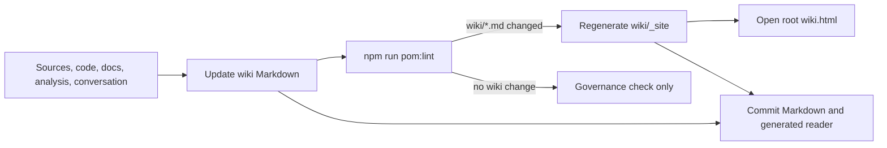

# POM - Project Operating Memory

**POM** is a lightweight method for keeping a project's operating memory alive by connecting sources, code, mockups, wiki pages, decisions, verifiable tasks, roadmap context, and official documentation.

This README is POM's canonical entry point and operating overview. Detailed procedures live in the repository's canonical files: `AGENTS.MD`, `skills/`, `prompts/`, `templates/`, and `scripts/`.

POM is designed to be reused on new or existing projects. It does not impose a single application structure and does not assume that every project has mockups, source code, tests, or official docs. For existing projects, POM should first map the current structure in `pom.config.json`; migration to canonical folders is a later explicit decision, not a prerequisite.

Version: `0.7.0`

Release notes: see `CHANGELOG.md`.

## Credits

POM - Project Operating Memory is created and maintained by **Fabio Malpezzi**.

Website: <https://www.improveandmanage.com/>

Special thanks to **Andrej Karpathy** for the LLM Wiki pattern that inspired POM's persistent wiki approach.

Special thanks to **Kun Chen** for [Agent eXperience Interface (AXI)](https://github.com/kunchenguid/axi), whose principles for agent-facing CLIs strongly inspired POM's `mcp-interface` guidance for designing efficient interfaces exposed to AI agents.

Special thanks to **[Supermemory](https://github.com/supermemoryai/skills)** for its public work on persistent agent memory and skill-based context delivery, which helped inspire POM's compact, on-demand operating guidance.

## Readable Guides

For a reader-friendly explanation of POM's purpose, tools, adoption levels, skills, and recommendations, see:

- [POM Guide in English](docs/POM_GUIDE.en.html)
- [Guida POM in italiano](docs/POM_GUIDE.it.html)
- [POM Wiki Reader](wiki.html)

Official documents for installation and for the local repository browser:

- [Installation Guide](docs/installation.md): Pi package, bootstrap, presets, updates, overlay mode, manual and non-npm installs, project structure after install, pre-commit hook.
- [POM Project Reader](docs/project-reader.md): the local repository browser, its profiles, search, annotations, and cmux integration.

These guides are explanatory or generated reader views, not normative replacements. Operational rules remain in `README.md`, `AGENTS.MD`, `prompts/`, `skills/`, `templates/`, `scripts/`, and the source Markdown under `wiki/`.

## Quickstart

### Install

Requirements: Node.js >= 22.6 and Git. From the target project root:

```bash
curl -fsSL https://raw.githubusercontent.com/FabioMalpezzi/pom/main/bootstrap-pom.mjs -o bootstrap-pom.mjs
node bootstrap-pom.mjs --preset owned
```

Do not clone the POM Source into a project root; the bootstrap keeps the method under `pom/` and project-owned files at the root. Choose the preset from your relationship to the repository:

| Preset | Use when | Meaning |
|---|---|---|
| `owned` | The project is yours | POM may become project governance when useful. |
| `team` | The project is shared with a team | POM must preserve shared conventions unless explicitly changed. |
| `overlay` | The repository belongs to an external upstream | POM is local understanding memory only. |
| `minimal` | You want only the smallest local setup | POM starts with minimal memory and no ownership assumption. |

Everything else about installing (Pi package, pinned installs, updates with `pom:update`, overlay mode, manual and non-npm installs, the pre-commit hook) is in the [Installation Guide](docs/installation.md). When asking an AI agent to install POM, say `POM - Project Operating Memory from FabioMalpezzi/pom` so it does not confuse POM with Maven `pom.xml` or Page Object Model. Suggested AI-agent prompt:

```text
Install POM - Project Operating Memory from https://github.com/FabioMalpezzi/pom in this target project. Treat that repository's docs/installation.md as the installation authority for this turn. Fetch or read that guide first, then follow it. Do not use Maven, Page Object Model, or a remembered POM workflow. Do not clone the repository into the project root; use the bootstrap from the target project root. If I have not stated a preset, ask me to choose one of owned, team, overlay, or minimal.
```

If you already know the preset, include it in the prompt, for example: `Use preset owned.`

### Choose A Workflow

Use the smallest workflow that matches your situation:

| Situation | Start Here |
|---|---|
| Start or route POM-aware work | `skills/using-pom.md` |
| Ambiguous request or artifact | `skills/clarify.md` |
| New project | `skills/seed.md` |
| Existing project | `skills/adopt.md` |
| External repository you do not own | Overlay mode in `specs/SPEC-0004-external-project-overlay.md` |
| Resume after a pause | `skills/pulse.md` |
| Ask or maintain the wiki | `skills/wiki.md` |
| Render the wiki reader | `npm run pom:wiki:render` |
| Browse, search, and annotate the project locally | `npm run pom:reader -- --port 4173` ([POM Project Reader](docs/project-reader.md)) |
| Change POM itself (extend, improve, prune) | `skills/method.md` |
| Close a numbered version | `skills/release.md` |
| Move adopted folders toward canonical roots | `skills/migrate.md` |
| Have two coding agents build and review multi-turn work as controller and executor | `skills/tandem.md` |
| Diagnose a POM problem | `skills/diagnose.md` |
| Debug a Target Project problem | `skills/root-cause.md` |
| Rework a patch around the intended final shape | `skills/zero-tech-debt.md` |
| Challenge a spec or decision before closure | `skills/challenge.md` |
| Defer work without implementing | `skills/defer.md` |
| Refresh or sync POM in a project | `skills/sync.md` |
| Finish branch, PR, merge, or cleanup work | `skills/finish-branch.md` |
| Model, validate, diagram, and implement domain workflows, including opt-in Dynamic Workflow control planes | `skills/workflow.md` (opt-in via `workflows.enabled` and `workflows.dynamic.enabled` for Dynamic Workflow in `pom.config.json`) |
| Model and evaluate agent-shaped goal loops in Target Projects | `skills/loop-goal.md` (opt-in via `workflows.enabled` and `workflows.loopGoal.enabled`; YAML FSM schema/validator is mandatory, templates are optional starting points) |
| See available commands | `npm run pom:help` |

### How to talk to the agent

Once POM is installed, tell the agent what you need. The agent reads the skill card, then the linked prompt, then the relevant templates.

```text
# Start a POM-aware session or choose the right POM workflow
Read pom/skills/using-pom.md and route this request before acting.

# Bootstrap a new project
Read pom/skills/seed.md and set up POM for this project.

# Build the wiki from existing sources
Read pom/skills/wiki.md in build mode and create the wiki.

# Generate the static wiki reader
npm run pom:wiki:render

# Open the static wiki reader
wiki.html

# Open the local Project Reader server
npm run pom:reader -- --port 4173

# Resume after a pause
Read pom/skills/pulse.md and update PROJECT_STATE.md.

# Turn a spec into tasks
Read pom/skills/plan.md and create a task plan from specs/my-feature.md.

# Defer future work
Read pom/skills/defer.md and park this topic without implementing it.

# Rework a patch around the intended final shape
Read pom/skills/zero-tech-debt.md and reshape the current change before closure.

# Debug a project bug or failing test
Read pom/skills/root-cause.md and identify the root cause before proposing fixes.

# Challenge a non-code spec or decision
Read pom/skills/challenge.md and run an adversarial thesis/antithesis review of specs/my-feature.md.

# End-of-session handoff
Read pom/skills/handoff.md and update the project state.

# Finish a branch, PR, merge, or cleanup decision
Read pom/skills/finish-branch.md and present the safe delivery options.
```

See `examples/agent-conversations.md` for more detailed interaction examples.

## POM Project Reader

The POM Project Reader is a supported local web server for browsing a repository without turning generated HTML into a new source of authority. Start it with `npm run pom:reader -- --port 4173` and open `http://127.0.0.1:4173`. Profiles, search, annotations, the cmux integration, and the agent-side `claim-next` handoff are documented in [docs/project-reader.md](docs/project-reader.md).

## Origin And Attribution

POM's wiki model is inspired by Andrej Karpathy's **LLM Wiki** pattern, published in the `karpathy/llm-wiki.md` gist:

```text
https://gist.github.com/karpathy/442a6bf555914893e9891c11519de94f
```

The local reference copy of the method is in `WIKI_METHOD.md`.

The gist describes a Markdown wiki maintained incrementally by an LLM, with raw sources, wiki pages, an operating schema, ingest/query/lint operations, an index, and a log.

## Language Policy

POM is documented in English for portability.

When applying POM to a project, the agent must use the project/user language for:

- conversation;
- generated documentation;
- wiki pages;
- ADRs;
- task plans;
- project state;
- reports.

If the project already has a dominant documentation language, follow it. If the user asks for a different language, follow the user. If sources are multilingual, preserve source titles and quoted terms, but write synthesis in the project/user language.

## Principle

POM does not use one universal source of truth. It uses source authority by domain: code and tests for current behavior, the wiki for current knowledge, the configured decisions root for rationale, `analysis/` for supporting analysis, Open Discussion for what is still desiderata or unresolved, `mockups/` for the intended experience, `docs/` for shareable documentation, and `PROJECT_STATE.md` or the current plan for the restart point. When sources diverge, the divergence must be made visible, analyzed, and resolved with a decision when needed.

The normative text is the Source Authority block of the installed POM section (`templates/agents/00-core.md`), which every target project loads at session start.

## Artifact Policy

POM separates source authority from edit permission. Before changing a governed artifact, check project config or the file itself: `editable` may be changed directly when the source authority supports it; `approvalRequired` needs explicit user approval; `generated` must be regenerated from its source; `historical` should not be rewritten after closure.

## Operating Discipline

Six operating rules apply to every project that uses POM, independently of the adoption profile:

- Communication style with the user
- Documentation discipline
- Work from sources, not memory
- Evidence discipline
- File size and static analysis guardrails
- Complexity standards

They are reproduced in `AGENTS.MD` so the agent reads them at start of session. Keep the full normative text in `AGENTS.MD` and treat this section as the overview.

Continuous integration is optional. POM runs entirely on local commands and the pre-commit hook; nothing breaks if a project never sets up a remote pipeline. When the target project does want CI, see `pom/templates/CI_GUIDE_TEMPLATE.md` for provider-agnostic snippets (GitHub Actions, GitLab CI, CircleCI, generic shell). POM does not install or generate workflow files; the template is a starting point the project copies and adapts.

## Git And History

POM assumes Git as an operational prerequisite when the project must be governed over time.

Rules:

- Git keeps fine-grained history for specs, ADRs, wiki pages, and code;
- do not duplicate detailed history inside ADRs, specs, or `PROJECT_STATE.md`;
- check `git status` before major reorganizations;
- if the project is not under Git, initialize Git before applying POM structurally; the installer does this automatically during setup;
- after structural changes, run available lint/tests and create a descriptive commit.

### Branching Policy

Specs, task plans, ADRs, wiki pages, and other documentation can be committed directly to the main branch. They are governed documents, not executable code, and do not risk breaking the build.

Create a feature branch (`feat/<topic>`) only when the first task plan step modifies executable code, configuration, prompts consumed at runtime, or test fixtures. The branch isolates changes that could break the build or alter runtime behavior.

| Artifact | Branch needed? |
|---|---|
| Spec, task plan, ADR, wiki page, analysis | No — commit on main |
| Source code, runtime config, prompts, test fixtures | Yes — feature branch |
| Experiment or spike | Yes — `exp/<topic>` or temporary branch |

When code or experiment branch work is ready to close, use `skills/finish-branch.md`. It verifies current state before any success claim, then guides the choice to merge locally, push and create a Pull Request, keep the branch, or discard it with explicit confirmation.

## ADR And Spec Changes

Specs are living documents: edit them directly and let Git keep fine-grained history.

ADRs represent decisions. If a decision changes substantially, do not simply rewrite the previous ADR. Create a new ADR that supersedes or replaces it, or update the existing ADR only when the change is administrative.
Use Open Discussion or analysis for undecided alternatives; do not create Draft ADRs for options that have not been chosen.

Rules:

- minor spec/ADR change: edit directly + Git;
- substantial spec change: update the spec and evaluate tasks/review;
- changed decision: create a new or replacement ADR;
- do not maintain manual changelogs inside specs/ADRs unless explicitly requested;
- every ADR should expose `Category` and `Area` in the opening metadata table;
- lint generates an ADR index from those metadata fields as a search/navigation view, not as a second source of truth;
- do not introduce workflow states in ADRs: if a document is in the configured decisions root, it is a valid decision; replacements are handled through `Replaces` and `Replaced by`.

## Temporary Experiments

Experiments must remain separate from the stable codebase until evaluated. Use branch `exp/<topic>`, `/tmp`, or `experiments/<topic>/` depending on the case. Consolidate only after evaluation.

For risky or broad experiments, prefer a Git worktree on an `exp/<topic>` branch so the main working tree stays clean. Detect existing linked worktrees and submodules before creating another worktree, and prefer a harness-native workspace/worktree feature when one is available. Keep trial dependencies, environment files, service config, generated output, and external repositories isolated from stable source unless adoption is approved. Stable source must not import from `experiments/`; use lint/type/build guardrails where the project already has them.

See `prompts/09-run-temporary-experiment.md` for the full workflow. Use `skills/finish-branch.md` after evaluation when the experiment branch or worktree needs merge, PR, keep, discard, or cleanup handling.

## Persistent Wiki

POM treats the wiki as a persistent, cumulative artifact, not a temporary RAG index. The agent should not rediscover everything from scratch on every question: it should maintain structured, interlinked, current knowledge.

Rules:

- the wiki contains the current synthesis, not the full history of decisions;
- sources, code, mockups, and analysis feed the wiki;
- the configured decisions root keeps decision rationale and decision history;
- `wiki/index.md` is the content map;
- `wiki/log.md` is the append-only chronological register and is not rendered as a reader page;
- `npm run pom:wiki:render` generates `wiki/_site/` as a static reader view;
- `wiki.html` at the project root is the stable human shortcut to the generated reader when the wiki is enabled, and explains how to enable or generate the wiki when the reader is missing;
- a useful answer or analysis can become a new wiki page;
- every relevant update should check contradictions, stale claims, missing links, and orphan pages.

The generated reader is derived output. It is useful for browsing and search, but Markdown remains the canonical Operating Memory. `pom:lint` regenerates `wiki/_site/` at the end only when Git reports changed Markdown pages under `wiki/`; `npm run pom:wiki:render` remains available for explicit regeneration.

Wiki pages may define optional YAML frontmatter with `navTitle` when the H1 is too long for reader navigation. The reader uses `navTitle` in side navigation, breadcrumbs, and previous/next links, while keeping the full H1 as the page title and search text. Omit `navTitle` when the H1 is already short enough.

Mermaid rendering is opt-in. By default, the generated reader does not load Mermaid or any external CDN; it shows Mermaid blocks as readable source. If a project passes `--mermaid-runtime` with a remote URL, the generated reader will fetch that module in the browser. Offline or sensitive environments should use no runtime or a local vendored runtime. POM does not add Subresource Integrity for remote Mermaid modules.

### Wiki Reader Lifecycle


```mermaid
flowchart LR
  S[Sources, code, docs, analysis, conversation] --> W[Update wiki Markdown]
  W --> L[npm run pom:lint]
  L -->|wiki/*.md changed| R[Regenerate wiki/_site]
  L -->|no wiki change| O[Governance check only]
  R --> H[Open root wiki.html]
  W --> G[Commit Markdown and generated reader]
  R --> G
```

Operational rules:

- edit `wiki/*.md`, not `wiki/_site/*.html`;
- run `npm run pom:lint` after wiki changes;
- let lint regenerate `wiki/_site/` when Git reports changed wiki Markdown;
- use `npm run pom:wiki:render` when an explicit reader refresh is needed;
- commit Markdown and regenerated reader output together when the reader output is tracked.

## Operating Cycle

```text
Inputs / Code / Mockups / Analysis / Conversation
        -> Wiki
        -> Decisions
        -> Delivery Plan
        -> Docs
        -> Project State
```

## POM Minimal

Small projects can start with a minimal POM setup. Mockups, official docs, structured tests, and extended lint are not required at the beginning.

Recommended minimum:

```text
agent instruction file or rule
PROJECT_STATE.md
wiki/index.md
wiki/log.md
configured decisions root (default `decisions/`)
optional pom.config.json
```

Rules:

- use `skills/seed.md` for a new project or `skills/adopt.md` for an existing project;
- create only the directories that are actually useful;
- use `PROJECT_STATE.md` as restart memory;
- use `wiki/` only when there is knowledge worth maintaining over time;
- use ADRs only for decisions that change direction or constrain the project;
- add lint, mockups, docs, tests, or an extended roadmap when the project grows.

## Planning, Verification, And Conventions

These rules are normative in the installed POM section and the skills, not here:

- **Work planning hierarchy** (`Roadmap -> Phase -> Workstream -> Task -> Step`, verification at every level, short form `Task -> Step` for small projects): `templates/agents/30-planning.md`; task creation in `prompts/05-create-task-plan-from-spec.md`.
- **Completion verification gate** (goal-backward check first; two positive and one misuse scenario for code; thesis and confuted antithesis for non-code; `validate` for significant closures; separate agent or fresh context when available; "Complete with exceptions" only with a documented reason): invariant in `templates/agents/30-planning.md`, full procedure in `skills/check.md` and `prompts/06-review-task-phase.md`.
- **Test convention** (`tests/<analysis-or-workstream-or-module>/{e2e,integration,fixtures,evidence}` and `tests/cross-system/`, sharing the namespace of `analysis/` and `tasks/`): `templates/agents/30-planning.md`; portable defaults for analysis and task paths in `skills/README.md`.
- **Docs and source conventions** (`docs/` and `src/` are proposals; existing roots such as `doc/`, `apps/`, `packages/`, `services/`, `frontend/`, or `backend/` are mapped in `pom.config.json` before any migration): `templates/agents/80-docs-source.md` and `prompts/08-create-pom-config.md`.

Lint reads the `tests`, `documentation`, and `source` sections of `pom.config.json`. Existing project conventions are never moved automatically; the agent asks before changing an existing structure.

## POM Folders

| Folder | Contents |
|---|---|
| `WIKI_METHOD.md` | cited reference copy of the original LLM Wiki method |
| `prompts/` | reusable prompts for applying the method |
| `skills/` | short skill cards derived from the main POM prompts |
| `templates/` | reusable templates for project state, tasks, specs, ADRs, wiki, docs, experiments, reconciliation, workflow YAML, optional workflow runtime seams, and the target-project updater |
| `scripts/` | installer, command help, documentation lint, wiki rendering, and Project Reader tooling |
| `examples/` | concrete examples of filled POM documents (ADR, PROJECT_STATE, wiki page) |

## POM Skills

POM skills are short operational aliases for the main prompts. They do not replace prompts: they help the agent choose the correct workflow.

<!-- POM:SKILL-CATALOG:START -->
Generated from `skills/README.md` by `npm run pom:skills:sync`. Edit the catalog there, not this table.

| Skill | Purpose | Canonical prompt |
|---|---|---|
| `using-pom` | bootstrap a POM-aware session and route to the right skill | `prompts/32-using-pom.md` |
| `clarify` | clarify ambiguous work before creating memory or changing method | `prompts/20-clarify-pom-work.md` |
| `seed` | start POM on a new project | `prompts/01-bootstrap-new-project.md` |
| `adopt` | adopt POM in an existing project | `prompts/02-adopt-existing-project.md` |
| `pulse` | create or update `PROJECT_STATE.md`; resume after a pause, a restart-context change, or a changed current state | `prompts/03-create-project-state.md` |
| `plan` | turn specs/ADRs into verifiable tasks | `prompts/05-create-task-plan-from-spec.md` |
| `check` | verify that completed work is really done: goal achieved, tests, lint, consistency, risks | `prompts/06-review-task-phase.md` |
| `handoff` | close a session by updating memory and status | `prompts/07-update-project-after-work.md` |
| `reader-notes` | process human Project Reader notes through source-backed edits and outcome recording | `prompts/26-process-reader-notes.md` |
| `diagnose` | debug failing or confusing POM workflows with a focused feedback loop | `prompts/22-diagnose-pom-problem.md` |
| `root-cause` | investigate Target Project bugs, test failures, build failures, and unexpected behavior before fixes | `prompts/34-root-cause-debugging.md` |
| `mcp-interface` | design, audit, reshape, or verify MCP interfaces for agent ergonomics | `prompts/35-mcp-interface.md` |
| `zero-tech-debt` | reshape a scoped change around the intended product and architecture end state | `prompts/23-zero-tech-debt.md` |
| `challenge` | run adversarial thesis/antithesis review before accepting or completing non-code work | `prompts/24-challenge-antithesis.md` |
| `config` | create or update `pom.config.json`; set or revise governance, lint, decision records, mock manifests, and agent rules beyond the installer | `prompts/08-create-pom-config.md`, `prompts/04-create-doc-governance.md` |
| `spike` | manage temporary experiments and their promotion decision (`adopt`, `refine`, or `reject`), including the Git branch/worktree choice for risky or exploratory work | `prompts/09-run-temporary-experiment.md` |
| `wiki` | build, query, check, or maintain the wiki | `prompts/10-build-wiki.md`, `prompts/11-review-stale-wiki.md`, `prompts/13-query-wiki.md`, `prompts/14-lint-wiki.md` |
| `method` | change POM itself in `extend`, `improve`, or `prune` mode; start in `prune` when the change may add method weight | `prompts/12-extend-pom.md`, `prompts/25-self-improvement-loop.md`, `prompts/21-prune-pom-method.md` |
| `status` | classify document type and choose the least misleading status | `prompts/15-classify-document-status.md` |
| `defer` | park important work without implementing it | `prompts/16-defer-work.md` |
| `sync` | refresh an existing POM installation or align source POM changes with a target project's `pom/`; also for a dirty `pom/`, a submodule update, or a vendored copy | `prompts/17-sync-pom-framework.md` |
| `finish-branch` | finish branch, PR, merge, keep, discard, or cleanup decisions | `prompts/33-finish-branch.md` |
| `release` | close a numbered version: changelog, version references, checksums, tag, memory updates | `prompts/36-release.md` |
| `migrate` | move an adopted project's folders toward canonical roots with approval and lint before and after | `prompts/37-migrate-structure.md` |
| `tandem` | coordinate two coding agents on multi-turn work as controller and executor (`setup`, `run`, `close`), with a fixed verdict contract, a per-task cycle cap, and escalation to the user | `prompts/38-tandem.md` |
| `reconcile` | classify and resolve a divergence between a source and project memory | `prompts/19-reconcile-memory.md` |
| `validate` | audit governed memory read-only after significant actions: project state, wiki, task status, decisions, orphans | `prompts/18-post-action-validator.md` |
| `workflow` | design, validate, diagram, scenarios, and implement domain workflows declared as YAML state models | `prompts/27-workflow-modeling.md` |
| `loop-goal` | define-criteria, audit, criteria-scenarios, conclude for opt-in agent loop/goal experiments in Target Projects; the contract is the `## Criteria` section of `EXPERIMENT.md`, modeling and implementation guidance go through `workflow`; when to use vs `workflow` -> `ADR-0003` | `prompts/28-loop-goal-define-criteria.md`, `prompts/29-loop-goal-audit.md`, `prompts/30-loop-goal-scenarios.md`, `prompts/31-loop-goal-conclude.md` |
<!-- POM:SKILL-CATALOG:END -->

### Skill Usage Tracking

`pom.config.json` may include `skillUsage` and `promptUsage` for projects that want lightweight observability on which POM workflows are actually used.

```json
{
  "skillUsage": {
    "wiki": { "count": 3, "lastUsed": "2026-05-01T18:30:00Z" },
    "plan": { "count": 1, "lastUsed": "2026-05-01T14:00:00Z" }
  }
}
```

The schema is extensible: additional fields can be added without breaking existing entries.

Treat this as optional telemetry, not a global operating rule. If a project wants it, the agent can update the matching counter and `lastUsed` timestamp when it reads a skill card or canonical prompt. If the project does not use tracking, do not add noise to `pom.config.json` just because a skill was consulted.

## Extending POM

Use `skills/method.md` in `extend` mode when POM needs to be extended, and in `prune` mode first when the change may add method weight.

POM is extended by levels. First choose the smallest necessary level, avoiding turning a local adaptation into a general rule.

| Need | Where To Change |
|---|---|
| Adapt POM to a specific project | `pom.config.json` |
| Change governed document shape | `templates/` |
| Change an agent operating procedure | `prompts/` |
| Make a recurring workflow easy to invoke | `skills/` |
| Automate or enforce a rule | `scripts/lint-doc-governance.ts` or equivalent script |

Rules:

- modify `pom.config.json` for project-specific folders, categories, severities, tests, wiki, docs, source, or mockups;
- modify a template when the expected structure of ADRs, specs, task plans, wiki pages, docs, or manifests changes;
- add or modify a prompt when the way the agent works changes;
- add a skill only when the workflow becomes recurring and deserves a short alias;
- update lint when a rule should be verified without rereading the whole project;
- update `PROJECT_STATE.md` when the extension changes the operating method or restart context;
- after every extension, run `npm run pom:lint` when available.

## Lint Configuration

Documentation lint is optional and project-specific. POM provides conventions and a config template, but this repository does not require every target project to install a lint runtime.

The portable lint configuration lives in:

```text
pom/templates/POM_CONFIG_TEMPLATE.json
```

Each project can copy it to the repository root as:

```text
pom.config.json
```

Rules:

- Keep `pom/templates/POM_CONFIG_TEMPLATE.json` generic and portable; keep project-specific rules in `pom.config.json`.
- The template assumes POM is installed under `pom/`; if installed elsewhere, adapt paths before running lint.
- Do not customize files directly under `pom/` for a target project; place localized/custom templates outside `pom/` and map them via `pom.config.json`.
- Lint should use conservative defaults when `pom.config.json` is missing and produce clear `config-invalid` errors when it exists but is invalid.
- Lint should read required sections (`##` headings) from the configured templates, not from hardcoded rules. This also makes translated templates work automatically.

For the full workflow (ownership mode, adoption profile, template overrides, mapping existing roots), use `skills/config.md` and `prompts/08-create-pom-config.md`.

## Porting Lint To Another Project

1. Install POM as `pom/` or copy the lint script;
2. copy `pom/templates/POM_CONFIG_TEMPLATE.json` to the project root as `pom.config.json`;
3. adapt `pom.config.json` to the real project structure;
4. run `node --experimental-strip-types pom/scripts/install-pom.ts` or add `npm run pom:lint` manually;
5. run lint and fix real errors, leaving warnings as progressive adoption guidance;
6. install a pre-commit hook only when the project is stable enough.

Rule: lint must remain a low-cost governance support, not a barrier to POM adoption.

## Templates And Lint

In POM, templates are the normative source for document shape.

```text
templates/
        -> lint
        -> real documents
```

When a template changes, lint should adapt by reading the required sections from the template. This avoids duplicating rules in both templates and hardcoded script logic.

Rule:

```text
template = rule
lint = enforcement
```

Canonical templates:

| Template | Use |
|---|---|
| `ADR_TEMPLATE.md` | decision record |
| `AGENTS_POM_SECTION_TEMPLATE.md` | POM section for agent instruction files |
| `CI_GUIDE_TEMPLATE.md` | optional CI starting point (GitHub Actions, GitLab CI, CircleCI, generic shell) |
| `CURRENT_PLAN_TEMPLATE.md` | short roadmap and current activities |
| `POM_CONFIG_TEMPLATE.json` | portable documentation lint config |
| `WORKFLOW_TEMPLATE.yaml` | optional reference starting point for workflow YAML finite-state-machine models |
| `PIPELINE_TEMPLATE.yaml` | optional reference starting point for linear pipeline workflows |
| `WORKFLOW_IMPLEMENTATION_GUIDE.md` | implementation patterns for translating validated workflow YAML into target code |
| `WORKFLOW_INTEGRATION_GUIDE.md` | adoption, migration, lifecycle, versioning, and retirement guide for workflow modeling |
| `WORKFLOW_RUNTIME_TEMPLATE.ts` | optional TypeScript target-project seam template for execution, persistence, timers, retry, tools, and side effects |
| `WORKFLOW_RUNTIME_TEMPLATE.py` | optional Python target-project seam template for execution, persistence, timers, retry, tools, and side effects |
| `EXPERIMENT_TEMPLATE.md` | versioned experiment or one-shot work |
| `MOCK_MANIFEST_TEMPLATE.md` | mockup package manifest |
| `OPEN_DISCUSSION_TEMPLATE.md` | non-authoritative desiderata, hypotheses, alternatives, and questions |
| `PROJECT_STATE_TEMPLATE.md` | project restart point |
| `TASK_PLAN_TEMPLATE.md` | verifiable task plan |
| `SPEC_TEMPLATE.md` | specifications |
| `DOC_TEMPLATE.md` | official documentation |
| `RECONCILIATION_TEMPLATE.md` | reconciliation between sources |
| `WIKI_INDEX_TEMPLATE.md` | wiki index |
| `WIKI_LOG_TEMPLATE.md` | chronological wiki log |
| `WIKI_PAGE_TEMPLATE.md` | generic wiki page |

## Agent Usage

Before creating a governed document, the agent must read and use the relevant template from `pom/templates/`. If a template does not fit the case, propose a template change before creating documents with a parallel structure. See the templates table above for the mapping. Workflow runtime seam templates are optional adapters for target projects; using them is not required, and POM still does not own runtime execution.
