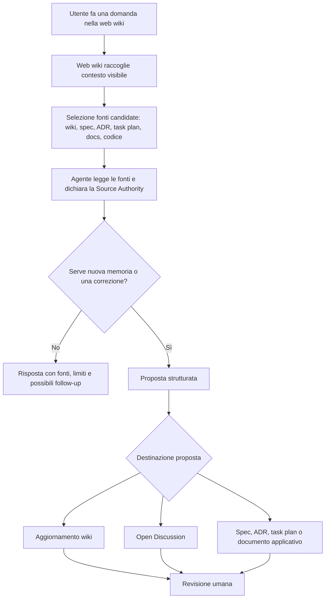
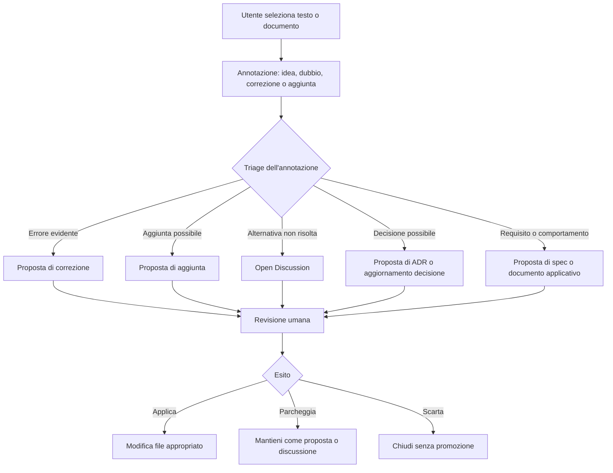
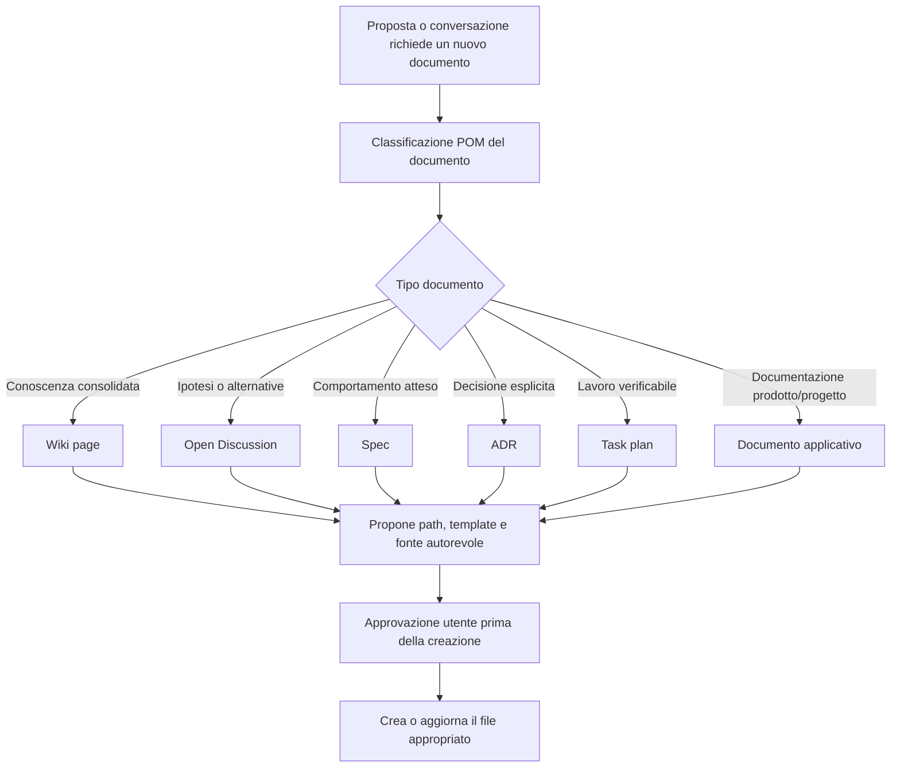
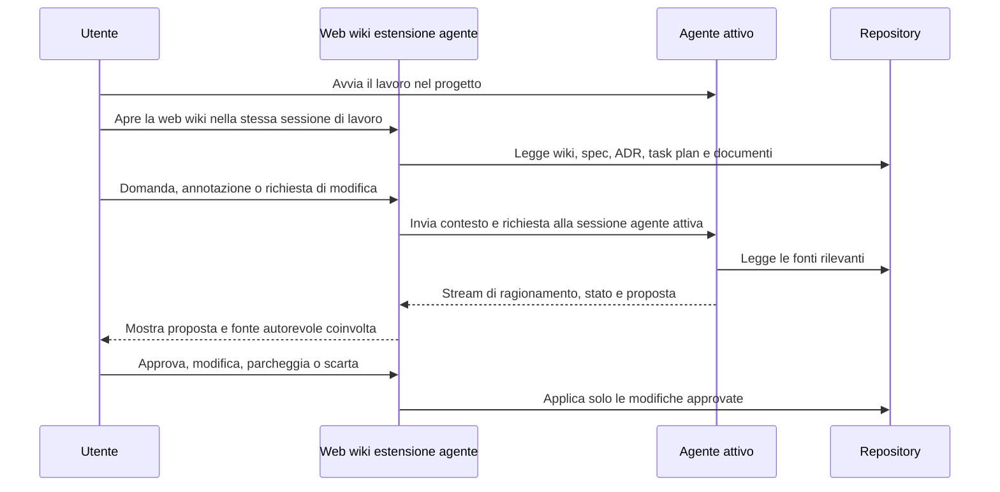

# Esperimento - Wiki locale, ricerca e annotazioni POM

| Campo | Valore |
|---|---|
| Data | 2026-05-19 |
| Tipo | research / architettura / agente |
| Stato | lightweight reader promoted; agent-session work deferred |
| Branch / Path | experiments/wiki-agent-orchestration |
| Isolamento | local manifest |
| Owner | POM maintainer |

Questo documento raccoglie ragionamenti preparatori. Non è una decisione, non è una specifica e non autorizza modifiche alla wiki o al metodo POM.

## Obiettivo

Valutare come rendere la wiki POM più utile dentro i progetti, passando da una memoria solo consultabile a una memoria interrogabile, annotabile e facile da prendere in carico da un coding agent.

La domanda pratica è: quando succede qualcosa nel progetto o nella UI della wiki, quale meccanismo deve portare l'informazione all'agente e riportare una proposta utile, verificabile e approvabile?

## Input

- Un web server potrebbe ospitare anche un server MCP.
- Claude Code, Codex, Pi o OpenCode potrebbero essere collegati a quel server o invocati da riga di comando.
- MCP supporta strumenti, risorse e notifiche, ma non implica automaticamente che un coding agent si attivi da solo quando arriva un evento.
- File e riga di comando restano il modo più semplice e osservabile per passare lavoro a un agente.
- La wiki POM deve restare Markdown nel repository. Eventuali HTML, indici o viste web sono derivati o generati.

## Correzione Di Scope - 2026-05-20

La direzione Project Cockpit e gli adapter verso sessioni agentiche persistenti sono stati giudicati troppo ampi per lo scopo di POM. Restano ricerca di sfondo, non target attivo.

Il target leggero era:

- un sito Node locale che parte dalla wiki e può estendere la navigazione a documentazione e sorgenti del progetto;
- ricerca deterministica con `rg`, con modalità regex opzionale;
- annotazioni salvate come file JSON nel repository;
- un comando semplice per i coding agent che legge la prossima annotazione aperta e la prende in carico;
- uso iniziale di Git solo per storico read-only, per esempio `git log -- <path>`.

Questo mantiene POM sul suo ruolo: Operating Memory in file verificabili. Il sito non diventa IDE, orchestratore multi-agente o fonte di verità alternativa.

## Promozione Del Project Reader - 2026-05-24

Il target leggero è stato promosso fuori da `experiments/` come tooling POM supportato:

- server, UI pubblica, rendering documenti, classificazione fonti e CLI annotazioni vivono in `scripts/project-reader/`;
- il comando installato consigliato è `npm run pom:reader -- --port 4173`;
- le annotazioni runtime usano `.pom-reader/annotations/` di default invece della cartella di evidenza dell'esperimento;
- i contratti, le fixture e le evidenze sotto `experiments/wiki-agent-orchestration/` restano memoria preparatoria e materiale di verifica, non codice stabile.

Restano fuori dalla promozione l'integrazione streaming con una sessione agente persistente, le query LLM dirette e il Project Cockpit.

Formato minimo di annotazione:

| Campo | Scopo |
|---|---|
| `annotationId` | Identificatore stabile del file di annotazione |
| `status` | Stato: `new`, `triaged`, `in_progress`, `resolved`, `parked`, `discarded` |
| `target.path` | File annotato |
| `target.kind` | Tipo del target, per esempio wiki, spec, task, code o other |
| `target.lineStart` / `target.lineEnd` | Righe annotate quando note |
| `selectedText` | Testo selezionato nella UI |
| `annotation` | Nota, dubbio o richiesta scritta dall'utente |
| `takenBy` / `takenAt` | Agente o persona che ha preso in carico l'annotazione |
| `resolution` | Esito quando l'annotazione viene chiusa |

Comando agente minimo:

```bash
node scripts/project-reader/wiki-tools.mjs claim-next --by codex
```

Ricerca e storico restano separati dall'agente:

```bash
node scripts/project-reader/wiki-tools.mjs search "Operating Memory"
node scripts/project-reader/wiki-tools.mjs search "Memory Element|Source Authority" --regex
node scripts/project-reader/wiki-tools.mjs history --path wiki/overview.md
```

## Scenari D'Uso Della Wiki

La web wiki deve supportare almeno tre casi d'uso distinti. Sono collegati tra loro, ma conviene modellarli separatamente per non confondere lettura, annotazione, proposta e promozione.

### 1. Domande, ragionamento e produzione assistita

L'utente usa la wiki come punto di ingresso per fare domande sul progetto, ragionare sui documenti esistenti e confrontare wiki, specifiche, decisioni, task plan, codice o documenti applicativi collegati.

L'agente non deve limitarsi a cercare una risposta. Deve aiutare a capire quali fonti leggere, dove ci sono lacune o contraddizioni, e quale memoria nuova potrebbe servire.

Trigger tipici:

- domanda su una pagina wiki;
- confronto tra una pagina wiki e una specifica;
- richiesta di spiegazione su una decisione;
- dubbio su una contraddizione tra documenti;
- richiesta di generare una sintesi riusabile.

Output possibili:

- nuove pagine o sezioni per la wiki;
- correzioni alla wiki esistente;
- proposte di aggiornamento a specifiche, decisioni o task plan;
- nuovi documenti applicativi quando emerge un bisogno reale;
- una Open Discussion se il ragionamento non è ancora pronto per diventare fonte autorevole.

Il punto critico è separare il ragionamento dalla promozione: l'agente può produrre una proposta, ma non deve trasformarla automaticamente in memoria autorevole.



### 2. Annotazioni su cambiamenti possibili

L'utente annota idee, dubbi o possibili cambiamenti direttamente mentre legge la wiki o i documenti del progetto.

In questo scenario l'annotazione è un input leggero: può riguardare una pagina wiki, una specifica, una decisione, un file di documentazione o un comportamento dell'applicazione.

Output possibili:

- una nota preparatoria collegata al documento letto;
- una proposta di modifica alla pagina wiki;
- una proposta di modifica a un documento del progetto;
- una richiesta di chiarimento prima di cambiare documenti governati;
- una Open Discussion quando l'annotazione contiene alternative o ipotesi non risolte.

Il punto critico è non confondere l'annotazione con una decisione. Un appunto dell'utente può attivare analisi e proposte, ma la modifica finale deve rispettare Source Authority, Artifact Policy e approvazione umana quando richiesta.



### 3. Creazione guidata di nuovi documenti

L'utente può arrivare a un punto in cui non serve solo correggere una pagina esistente: serve creare un nuovo documento. Il caso va trattato con cautela, perché creare documenti è uno dei modi più rapidi per aumentare rumore nel progetto.

L'agente deve prima classificare il documento richiesto:

- wiki, se la conoscenza è consolidata e riusabile;
- Open Discussion, se contiene desiderata, ipotesi o alternative;
- spec, se descrive comportamento atteso;
- ADR, solo se la decisione è esplicita;
- task plan, se il lavoro è eseguibile e verificabile;
- documento applicativo, se appartiene alla documentazione propria del progetto.



## Scenario Ideale: Web Wiki Come Estensione Dell'Agente

Questa sezione resta come memoria dell'ipotesi ampia. Dopo la correzione di scope del 2026-05-20 non è il percorso attivo dell'esperimento.

Nota successiva: la direzione di prodotto più ampia emersa dall'esperimento è raccolta in `experiments/wiki-agent-orchestration/PROJECT_COCKPIT.md`. Quel documento tratta la possibile evoluzione da web wiki a cockpit leggero del progetto, con tree documenti/codice, agente, bozze, proposte e Git diff integrati.

Il valore maggiore non è solo invocare un agente quando arriva un evento. Il valore maggiore è permettere all'utente di lavorare con un agente già aperto e operativo, per esempio Codex, e usare la web wiki come estensione dell'agente AI.

La web wiki non deve essere una cosa a parte rispetto all'agente. Deve comportarsi come una vista specializzata della stessa sessione di lavoro: l'utente continua a dialogare con l'agente, ma lo fa dentro un ambiente più adatto a leggere, collegare, annotare e modificare memoria di progetto.

La web wiki non deve essere solo una pagina che mostra Markdown renderizzato. Deve essere una mappa navigabile della memoria POM: pagine wiki, specifiche, decisioni, task plan, Open Discussion, Project State e altri documenti collegati. L'utente legge un contesto ricco di informazioni, ma non deve sentirsi dentro un archivio difficile da orientare.

Il ruolo dell'agente è aiutare a muoversi dentro questo contesto: trovare le fonti giuste, spiegare perché una pagina è rilevante, collegare un appunto a una specifica o a una decisione, e proporre modifiche senza far perdere il quadro generale.

La web wiki deve quindi essere anche una superficie di interazione con l'agente AI. L'utente dovrebbe poter selezionare una pagina, una sezione o un documento collegato, fare una domanda, annotare un problema, chiedere una correzione, proporre un'aggiunta o avviare la creazione di un nuovo documento.

L'agente risponde producendo una proposta strutturata, non una modifica implicita. La proposta può riguardare:

- correzioni a una pagina wiki;
- aggiunte a una pagina wiki esistente;
- nuove pagine wiki;
- aggiornamenti a spec, decisioni, task plan o Open Discussion;
- nuovi documenti applicativi quando il progetto ne ha bisogno;
- richieste di chiarimento quando la fonte autorevole o l'approvazione richiesta non sono chiare.

La web wiki dovrebbe rendere visibile lo stato della proposta: bozza, in revisione, approvata, applicata, parcheggiata o scartata.

Flusso desiderato:

```text
utente apre Codex e inizia a lavorare sul progetto
  -> utente apre la web wiki come estensione della stessa sessione agente
  -> utente legge wiki e documenti POM collegati
  -> utente ragiona su specifiche, decisioni, task plan o pagine wiki
  -> la web wiki invia domande, annotazioni e proposte alla sessione Codex attiva
  -> Codex mantiene il contesto operativo tra terminale e web wiki
  -> Codex propone o corregge wiki, ADR, spec, task plan o documenti applicativi
  -> l'utente approva la promozione nei file appropriati
```



In questo scenario lo streaming è importante perché mantiene vivo il turno di lavoro: l'utente vede lo stato dell'agente, può intervenire mentre ragiona, e non deve ricostruire a ogni comando il contesto già stabilito nella sessione. La web wiki diventa una modalità di interazione con l'agente, non un'applicazione separata che ogni tanto gli manda eventi.

Questo non elimina il ruolo di POM. Il contesto vivo dell'agente è utile durante la sessione, ma resta temporaneo. Le conclusioni che devono sopravvivere devono essere promosse nei Memory Element appropriati: wiki, Open Discussion, decisioni, specifiche, task plan o documenti applicativi.

Qualità attesa dell'esperienza:

- navigazione chiara tra wiki e documenti POM collegati;
- evidenza visiva di quali documenti sono fonti, proposte, discussioni aperte o memoria consolidata;
- lettura piacevole e ordinata, non solo funzionale;
- possibilità di passare da lettura, domanda, annotazione e proposta senza cambiare contesto mentale;
- agente disponibile come aiuto contestuale, non come sostituto della struttura documentale.

## Ipotesi

- La wiki diventa più utile se espone ricerca, lettura mirata, collegamenti, stato corrente e proposte di aggiornamento.
- Il bus eventi non dovrebbe essere MCP al primo prototipo. MCP è più adatto come interfaccia strumenti: cercare nella wiki, leggere pagine, proporre aggiornamenti, aprire discussioni.
- Il primo esperimento deve produrre proposte, non modifiche dirette alla fonte di memoria.
- Il percorso più robusto è: evento, coda, agente, proposta, revisione umana, eventuale promozione.
- Una sessione streaming persistente aumenta il valore dell'esperimento perché evita di trattare ogni interazione wiki come una chiamata isolata e permette all'agente di restare operativo sul progetto.
- Anche con una sessione persistente, POM non deve dipendere solo dal contesto volatile dell'agente: ciò che conta per il futuro deve essere scritto nei file appropriati.

## Vincoli Di Compatibilità Degli Agenti

Questa sezione resta utile come background, ma non guida più la prossima implementazione. La prossima implementazione deve evitare adapter specifici e passare da file, `rg` e comandi locali.

Trattare la web wiki come estensione dell'agente introduce vincoli più forti rispetto a un semplice flusso file + CLI. Ogni coding agent può avere interfacce, modelli di sessione, formati evento, strumenti, autorizzazioni e limiti diversi.

Aspetti da verificare per ogni agente:

| Area | Domanda di compatibilità |
|---|---|
| Sessione | L'agente supporta una sessione persistente riutilizzabile dalla web wiki? |
| Streaming | È possibile ricevere stato, ragionamento utile, tool call e output in tempo reale? |
| Input esterno | La web wiki può inviare domande, annotazioni o proposte alla sessione attiva? |
| Contesto | L'agente conserva il contesto operativo tra terminale, UI e strumenti? |
| File system | Le modifiche possono essere proposte, revisionate e applicate in modo controllato? |
| Permessi | L'agente espone un modello di approvazione o sandbox compatibile con POM? |
| MCP | MCP serve come interfaccia strumenti, come trasporto, o non serve nel primo adapter? |
| Testabilità | Il flusso può essere testato con fixture, eventi simulati e output atteso? |

Il rischio è costruire un'integrazione troppo specifica per un agente e poi scoprire che non si adatta agli altri. Per questo l'esperimento dovrebbe distinguere:

- contratto POM comune: evento, contesto, proposta, approvazione, promozione;
- adapter agente: traduzione tra contratto POM e interfaccia specifica di Codex, OpenCode, Pi, Claude Code o altri;
- test di compatibilità: suite minima che verifica se un adapter rispetta il contratto POM.

## Strategia Incrementale Di Supporto Agenti

Questa strategia è parcheggiata finché il flusso leggero non dimostra valore con annotazioni file-based.

Non conviene provare a supportare subito tutti gli agenti. La strada più sana è partire con uno o due coding agent, imparare dai vincoli reali, poi estendere.

Prima selezione candidata:

- Codex, perché offre superfici utili per `exec`, app-server, streaming e integrazione nel workflow POM;
- OpenCode, se si vuole validare presto un server agentico HTTP/SSE più orientato a una UI web;
- Pi RPC, se si vuole un secondo confronto più basso livello e controllabile.

Sequenza proposta:

1. Definire il contratto POM minimo per evento e proposta.
2. Implementare o simulare il primo adapter, preferibilmente Codex.
3. Testare i casi d'uso principali: domanda, annotazione, creazione nuovo documento, promozione approvata.
4. Aggiungere un secondo adapter solo dopo aver separato bene contratto comune e dettagli specifici.
5. Promuovere a spec solo ciò che resta valido per più di un agente, oppure dichiarare esplicitamente che una capacità è agent-specific.

## Opzioni Tecniche

| Opzione | Uso previsto | Vantaggi | Limiti |
|---|---|---|---|
| File + CLI | Primo prototipo | Semplice, debuggabile, versionabile, nessun server complesso | Avvio più lento, meno interattivo |
| Codex `exec` | Automazione one-shot | Output JSONL, adatto a script e CI, facile da integrare con inbox/outbox | Ogni run può avere overhead di avvio |
| Codex `app-server` | UI web con sessione agente persistente | Thread, turn, notifiche, stream eventi, più vicino a un backend agente già operativo | Architettura più impegnativa del prototipo base |
| Codex `mcp-server` | Orchestrazione multi-agente | Permette a un altro orchestratore di usare Codex come tool MCP | Non è il bus eventi primario della wiki |
| OpenCode `serve` | Web/server agentico già pronto | HTTP, OpenAPI, SSE, `run --attach`, buon fit per UI web | Richiede valutazione di provider, qualità modello e configurazione |
| Pi RPC | Laboratorio controllato | Protocollo JSON su stdin/stdout, eventi streammati, core piccolo e hackabile | Meno funzionalità pronte; MCP e workflow avanzati sono estensioni |
| Claude Code CLI / SDK | Compatibilità con workflow Claude | Buon ecosistema, MCP e SDK disponibili | Come attivatore eventi richiede comunque CLI, SDK o processo persistente |

## Lettura Provvisoria

Codex cambia lo scenario più di Claude Code perché offre più superfici di automazione utili al caso POM:

- `codex exec --json` per prototipi one-shot;
- `codex app-server` per un backend persistente con eventi;
- `codex mcp-server` per deleghe multi-agente da altri orchestratori.

OpenCode è interessante se l'obiettivo principale è una UI web subito programmabile, perché il suo server espone API HTTP ed eventi SSE.

Pi è interessante se l'obiettivo è capire e controllare il modello minimo: coda, sessione agente, eventi, output e proposta.

## Principio Di Sicurezza Metodologica

La wiki può diventare un punto di ingresso al ragionamento sul progetto, ma non deve diventare la fonte che decide tutto.

Ogni proposta generata dall'agente deve dichiarare quale domanda sta trattando e quali fonti ha letto. Se la domanda riguarda requisiti, architettura, decisioni, comportamento applicativo o documentazione governata, la proposta deve indicare quale fonte ha autorità su quel punto.

La wiki può sintetizzare, orientare e collegare. Non può sostituire automaticamente specifiche, decisioni, task plan, codice o documenti applicativi che il progetto considera autorevoli.

Regola preparatoria per l'esperimento: l'agente può suggerire aggiornamenti, ma la promozione resta un'azione distinta e approvata.

## Lifecycle Di Una Proposta

Il flusso deve impedire che una domanda o annotazione diventi memoria autorevole per errore.

```text
input utente o evento
  -> triage: domanda, annotazione, correzione, desiderata o possibile decisione?
  -> lettura delle fonti rilevanti
  -> proposta generata dall'agente
  -> revisione umana
  -> promozione, parcheggio o scarto
```

Possibili esiti:

- promozione in `wiki/` quando la proposta migliora la memoria operativa corrente;
- promozione in Open Discussion quando contiene ipotesi, desiderata o alternative non risolte;
- proposta di modifica a specifiche, decisioni, task plan o documenti applicativi quando quelle fonti sono responsabili del contenuto;
- scarto quando la proposta aggiunge rumore o non porta evidenza sufficiente;
- parcheggio quando il tema è utile ma non prioritario.

## Formato Minimo Di Proposta

Una proposta generata dall'agente dovrebbe essere abbastanza strutturata da poter essere approvata, corretta o scartata senza ricostruire il ragionamento.

Campi minimi:

| Campo | Scopo |
|---|---|
| Tipo input | Domanda, annotazione, correzione, desiderata, possibile decisione |
| Domanda trattata | Che cosa la proposta sta cercando di risolvere |
| Fonti lette | File o sezioni consultate |
| Fonte autorevole coinvolta | Dove deve vivere la risposta se viene promossa |
| Fatti osservati | Informazioni verificate nei file letti |
| Ipotesi | Parti non ancora verificate |
| Contraddizioni o lacune | Divergenze, assenze o ambiguità trovate |
| Modifica proposta | Testo o azione suggerita |
| Destinazione proposta | Wiki, Open Discussion, spec, decisione, task plan, documento applicativo, nessuna |
| Approvazione richiesta | Nessuna modifica, approvazione utente, approvazione specifica del documento |
| Ragione per non applicare automaticamente | Perché la proposta resta separata dalla promozione |

## Architetture Candidate

### Target Attivo: Wiki Locale, Ricerca E Annotazioni

```text
web/wiki UI
  -> legge wiki e documenti del progetto
  -> cerca con rg o regex su root consentite
  -> salva annotazioni JSON in evidence/annotations/
  -> coding agent esegue claim-next
  -> agente legge fonti correnti, produce proposta o modifica richiesta
  -> stato annotazione aggiornato
```

Questo è il percorso attivo perché resta piccolo, osservabile e aderente allo scopo di POM. La continuità dell'agente non è affidata a un adapter: è l'annotazione nel repository a trasferire il lavoro.

### Baseline: File E CLI

```text
web/wiki UI
  -> scrive evento in pom-events/inbox/
  -> worker invoca agente con prompt e riferimenti
  -> agente produce proposta in pom-events/outbox/
  -> utente approva, modifica o scarta
  -> solo dopo approvazione si aggiorna wiki/ o altro Memory Element
```

Esempio concettuale:

```bash
codex exec --json "Leggi l'evento POM in pom-events/inbox/<id>.json e produci una proposta di aggiornamento wiki senza modificare i file sorgente."
```

Questa baseline serve a verificare formato eventi, formato proposte e controllo di promozione senza introdurre subito un server agente persistente.

### Baseline Osservata: Mini UI Locale E Codex Attivo

Il primo ciclo locale validato usava una mini UI sperimentale invece di un runner automatico. Dopo la promozione del 2026-05-24, quel lettore vive come Project Reader stabile sotto `scripts/project-reader/`:

```text
web/wiki mini UI
  -> legge wiki e documenti POM dal repository
  -> salva un evento JSON in evidence/ui-events/
  -> la sessione Codex attiva legge l'evento
  -> Codex produce una proposta strutturata in evidence/
  -> Codex applica solo la correzione approvata o richiesta dall'utente
```

Questo ciclo dimostra il valore minimo senza fingere che l'integrazione sia già completa. La mini UI non parla ancora in streaming con l'agente e non richiama Codex da sola. Però rende osservabile il passaggio essenziale: un'azione nella web wiki può diventare un evento tracciabile, una proposta separata e una modifica controllata.

Il primo evento reale ha individuato un difetto del prototipo: `wiki/log.md` era visibile nella mini UI anche se il reader statico lo esclude già dalla navigazione. L'esito corretto è stato modificare il set documentale della mini UI, non cambiare la wiki canonica. Questa distinzione è importante perché mostra che l'agente deve prima classificare la fonte del problema e solo dopo proporre la destinazione della modifica.

### Target: Sessione Streaming Persistente

```text
Codex già aperto sul progetto
  <-> web/wiki UI collegata alla sessione attiva
  <-> stream di eventi, stato e risposte agente
  -> proposta strutturata
  -> approvazione utente
  -> modifica dei file appropriati
```

Questo target è più vicino all'esperienza desiderata: l'agente non perde il contesto operativo tra terminale e web wiki, e l'utente può lavorare su specifiche, decisioni e pagine wiki senza trasformare ogni interazione in un comando isolato.

Resta un vincolo: la sessione viva aiuta il lavoro corrente, ma non sostituisce la memoria durevole. A fine passaggio, ciò che deve restare deve essere scritto nel repository.

## Controllo Di Approvazione E Promozione

La promozione deve restare separata dalla risposta dell'agente. Il flusso minimo è:

```text
evento UI
  -> bozza agente in evidence/ o agent-drafts/
  -> proposta strutturata con destinazione e fonti
  -> revisione umana
  -> patch o modifica applicata solo dopo approvazione
  -> verifica con Git diff, lint o test appropriato
```

Stati minimi della proposta:

| Stato | Significato |
|---|---|
| draft | Output prodotto dall'agente, non ancora pronto per revisione |
| in_review | Proposta leggibile con fonti, destinazione e requisito di approvazione |
| approved | L'utente approva la promozione, ma la modifica non è ancora applicata |
| applied | La modifica è stata applicata e verificata |
| parked | La proposta resta utile ma non viene promossa ora |
| discarded | La proposta viene chiusa senza promozione |

Regole:

- una risposta dell'agente non può modificare direttamente wiki, spec, ADR, task plan o documenti governati;
- la proposta deve dichiarare destinazione autorevole, file letti, assunzioni, lacune o contraddizioni;
- una proposta `approved` deve produrre un diff leggibile prima di diventare `applied`;
- la promozione deve rispettare Source Authority e Artifact Policy;
- se la destinazione è incerta, lo stato corretto è `parked` o una Open Discussion, non un aggiornamento wiki;
- ogni promozione deve lasciare traccia in Git e passare il controllo più corto disponibile.

## Ruolo Possibile Di MCP

MCP non dovrebbe essere il primo bus eventi. Può diventare utile quando servono strumenti standard per agenti diversi:

- `wiki.search`
- `wiki.read_page`
- `wiki.propose_update`
- `project_state.read`
- `open_discussion.create`
- `artifact_policy.check`

In questo modello MCP espone capacità POM. L'attivazione resta responsabilità del controller, del worker o dell'app-server scelto.

## Criteri Di Valore

L'esperimento ha valore se dimostra almeno una di queste cose:

- una proposta wiki può essere generata da un evento senza modificare direttamente la fonte;
- la proposta cita i file letti e distingue fatti, ipotesi e decisioni mancanti;
- il flusso resta leggibile in Git e debuggabile senza infrastruttura fragile;
- il sistema riduce lavoro manuale senza trasformare la wiki in una fonte incontrollata;
- l'utente può approvare o scartare prima della promozione.

### Criteri Di Riuscita Della Fase 1

La prima fase non deve dimostrare MCP, streaming persistente o supporto multi-agente. Deve dimostrare un ciclo locale piccolo e verificabile:

- la web wiki legge documenti reali del repository;
- la web wiki cerca nel progetto con `rg`, senza inventare risultati;
- l'utente crea un evento da una domanda o annotazione;
- l'utente salva un'annotazione file-based con target, testo selezionato, nota e stato;
- un coding agent può prendere in carico la prossima annotazione aperta con un solo comando;
- l'evento resta distinto da decisioni, specifiche e wiki autorevole;
- l'agente legge l'evento e le fonti correnti, non la propria memoria;
- l'agente produce una proposta con fonti, fatti, ipotesi, lacune, destinazione e approvazione;
- una modifica viene applicata solo quando è limitata e richiesta o approvata dall'utente;
- il risultato resta verificabile con Git, lint e test.

Il secondo ciclo dovrebbe usare un evento di metodo, non un bug della UI. Un buon test è chiedere dalla web wiki una proposta di chiarimento su quando una nota resta Open Discussion e quando diventa spec, ADR o task plan.

## Rischi

| Area | Rischio | Mitigazione |
|---|---|---|
| Metodo | La wiki torna a essere fonte di verità universale | Mantenere Source Authority per tipo di domanda |
| Processo | L'agente modifica documenti senza approvazione | Separare proposta e promozione |
| Complessità | MCP viene usato prima che serva davvero | Primo prototipo con file + CLI |
| Rumore | Troppe proposte rendono la wiki meno leggibile | Criteri di valore e revisione umana |
| Sicurezza | Server locali esposti o MCP non autenticato | Bind su localhost, auth, nessuna esposizione remota senza decisione |
| Costi | Sessioni agentiche persistenti consumano più del previsto | Misurare durata, token, run e output |

## Non Obiettivi

- Non scegliere ora un vendor definitivo.
- Non sostituire Git come memoria storica.
- Non trasformare la wiki in backlog, issue tracker o chat log.
- Non fare aggiornamenti automatici alla fonte Markdown senza approvazione.
- Non progettare subito un sistema multi-agente completo.

## Esito Atteso

Decisione futura da prendere dopo il prototipo:

- scartare l'idea;
- mantenere solo una procedura file + CLI;
- creare una spec per un POM wiki assistant;
- creare un task plan per un prototipo Codex `exec`;
- creare un secondo task plan per Codex `app-server`, OpenCode server o Pi RPC;
- aggiornare la wiki solo con la sintesi consolidata.

## Follow-up

- [x] Definire il formato minimo di un evento wiki POM.
- [x] Definire il formato minimo di una proposta generata dall'agente.
- [x] Decidere il primo spike: baseline Codex con file + CLI, prima della sessione streaming persistente.
- [x] Stabilire dove salvare fixture ed evidenze dell'esperimento.
- [x] Documentare la direzione Project Cockpit come Open Discussion separata.
- [x] Definire il controllo di approvazione prima della promozione in `wiki/`.
- [x] Ridurre lo scope attivo a wiki locale, ricerca `rg`, annotazioni file-based e storico Git read-only.
- [x] Aggiungere un comando locale per ricerca, annotazioni e presa in carico.
