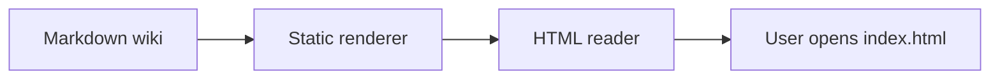

# Reader Capabilities

## Summary

This page documents the Markdown features supported by the static reader. It shows how generated HTML improves browsing without becoming a second source of truth.

## Current State

Markdown remains canonical. The reader generates HTML, CSS, search data, navigation, code presentation, and optional diagram enhancements from the source Markdown files.

## Static Workflow

The reader is designed as generated output, not as a running application. Its job is to make the Operating Memory legible after generation, then disappear into a static file tree.

```bash
npm run pom:wiki:render
```

After generation, the command prints the `file://` link for `wiki/_site/index.html`. The command is separate from `pom:lint` by default, so lint remains a governance check and reader generation remains an explicit derived-output step.

## Supported Markdown

| Feature | Rendering |
|---|---|
| Headings | Page outline and copyable section links |
| Paragraphs and emphasis | Editorial article typography |
| Bullet and numbered lists | Native lists with reader styling |
| Tables | Desktop tables and mobile card-like rows |
| Wikilinks | Links to generated page HTML |
| Markdown links | External URLs preserved, `.md` links rewritten to `.html` |
| Fenced code blocks | Language label, fixed-width layout, and optional syntax coloring |
| Mermaid blocks | Styled diagram source by default; renderable when a Mermaid runtime is configured |

## Fixed-Width Text

Use `text` or `ascii` fences for diagrams that must preserve spacing.

```ascii
Inputs / Code / Mockups / Analysis / Conversation
        -> Wiki
        -> Decisions
        -> Delivery Plan
        -> Docs
        -> Project State
```

## Programming Code

Known language fences get lightweight, dependency-free highlighting. The goal is readability, not a full IDE inside the wiki.

```js
const pages = loadPages(config);
for (const page of pages) {
  writeFileSync(join(config.out, page.output), renderPage(page, pages, config), "utf8");
}
```

```json
{
  "wikiReader": {
    "source": "wiki",
    "out": "wiki/_site",
    "theme": "pom/scripts/lib/wiki-reader-theme.css"
  }
}
```

## Mermaid Diagram Source

Mermaid support is optional so the default reader remains offline and dependency-free. Without a configured runtime, the reader keeps the Mermaid source readable and preserves the diagram as Markdown-owned memory.



## Generated Files

The renderer writes:

| Output | Purpose |
|---|---|
| `*.html` | Reader pages |
| `assets.css` | Generated copy of the configured theme |
| `reader.js` | Static search and section-link behavior |
| `search-index.json` | Machine-readable search data |
| `search-index.js` | Same data for direct `file://` opening |

## Open Questions

| Question | Status |
|---|---|
| Should Mermaid rendering use a vendored runtime, a local project runtime, or no runtime by default? | Open |
| Should syntax highlighting remain lightweight or adopt a library such as Shiki if the renderer is promoted? | Open |
| Should generated reader output be committed by default or regenerated locally after wiki updates? | Open for target projects; POM source commits the root reader output. |

## Related Links

- [[wiki-method]]
- [[experiments-and-extension]]
- [[templates-and-governance]]
