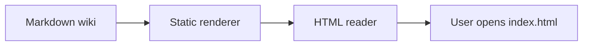

# Reader Capabilities

## Summary

This page documents the two reader surfaces POM currently exposes: the static wiki reader and the experimental local POM Project Reader server. Both improve consultation without becoming a second source of truth.

## Current State

Markdown and source files remain canonical. Reader output, browser state, search results, and annotations are consultation and handoff aids. Durable changes still happen in repository files through normal edits.

The static wiki reader generates HTML, CSS, search data, navigation, code presentation, and optional diagram enhancements from source Markdown files.

The POM Project Reader is a local Node server that reads the configured project root, exposes wiki/docs/source navigation, runs `rg` search, and writes file-based annotations for an agent to process.

## Project Reader Server

Project-wide content search requires `rg` from ripgrep.

Run the server from the repository root you want to inspect. By default, the current working directory is the project root and the local port is `4173`.

```bash
node experiments/wiki-agent-orchestration/mini-ui/server.mjs --port 4173
```

When POM is installed under `pom/` in a target project, run the POM-hosted script from the target project root:

```bash
node pom/experiments/wiki-agent-orchestration/mini-ui/server.mjs --port 4173
```

Use explicit parameters when needed:

```bash
node pom/experiments/wiki-agent-orchestration/mini-ui/server.mjs --port 4173 --root . --annotations-dir .pom-reader/annotations
```

The defaults are:

| Parameter | Default |
|---|---|
| `--port` | `4173`, unless `PORT` is set |
| `--root` / `--dir` | `.` |
| `--annotations-dir` | `experiments/wiki-agent-orchestration/evidence/annotations` under the project root |

Then open:

```text
http://127.0.0.1:4173
```

The server starts from `wiki/index.md` when a project has a wiki. If no wiki index exists, it exposes a generated `POM Project Reader` entry document and still lets the user navigate project documentation and selected source files.

When `pom.config.json` exists under the project root, it refines document classification. The reader uses configured roots for documentation, decisions, task plans, analysis, source, tests, mockups, and root-level Markdown. It also respects simple generated-output entries from `artifactPolicy.generated`, such as `wiki/_site/**`, in both navigation and project search. If the config is missing, the reader uses its built-in allowlist. If the config exists but is invalid JSON, the server reports the configuration error instead of guessing. The UI shows whether classification comes from `pom.config.json` or the built-in roots.

The server can show:

| Area | What It Exposes |
|---|---|
| Wiki | `wiki/*.md`, except generated output and the chronological `wiki/log.md` register. |
| Project documents | `README.md`, `CONTEXT.md`, `WIKI_METHOD.md`, `CHANGELOG.md`, configured documentation roots, examples, prompts, skills, templates, specs, decisions, and task plans when present. |
| Configured memory roots | Configured decisions, task plans, analysis, tests, mockup packages, and root-level Markdown files from `pom.config.json`. |
| Source and support files | Configured source roots, selected experiment files, scripts, tests, `bootstrap-pom.mjs`, and `package.json`. |

Navigation has two modes:

| Mode | Use |
|---|---|
| Thematic | Group documents by kind, such as wiki, project docs, decisions, task plans, experiments, and source. |
| Tree | Follow the repository path hierarchy when the user knows where a file should live. |

Search has two levels:

| Search | Use |
|---|---|
| Project search | Uses `rg` over the active document-kind filter, with optional regex mode. |
| In-file search | Searches the currently open document, with previous/next navigation and optional regex mode. |

The browser UI is designed for consultation rather than source editing:

| Surface | Behavior |
|---|---|
| Document pane | Uses a responsive page width. Prose remains measure-limited, while code blocks and tables can use wider desktop space. |
| Left navigation | Can collapse on hover or stay pinned. |
| Right annotation panel | Can collapse on hover or stay pinned. |
| Language labels | Can switch between English and Italian. |
| File limits | Rendering rejects files above 1 MB and binary-looking files. Search skips files above 1 MB. |
| Source editing | Not present in the browser workflow. Editing remains a normal repository operation outside the reader. |

The server binds to `127.0.0.1` and sends a restrictive Content Security Policy, `nosniff`, frame-denial, same-origin resource policy, and no-referrer headers. The reader is still a local repository browser and should not be exposed on a shared network without a separate threat model.

## File-Based Annotations

The right panel writes annotations as JSON files under the configured annotation directory. By default that is:

```text
experiments/wiki-agent-orchestration/evidence/annotations/
```

An annotation contains the target path, optional selected document text, the human note for the agent, status fields, and an `agentReport` field for what the agent did after processing the file.

Treat the annotation folder as runtime evidence and keep it out of commits unless the project intentionally wants to archive an annotation. If a project chooses a custom annotation directory, add it to the project's ignore rules.

The annotation panel separates new notes, in-progress work, and processed history. Opening an annotation shows the selected document text, the agent-facing note, the agent outcome when present, and the JSON work file on demand. The UI also tries to reopen the target document and highlight the selected text; processed annotations still remain readable even if the target document no longer exists.

The UI does not send requests directly to an AI agent. The annotation file is the handoff artifact: an agent reads it, claims it, works from current sources, and records the outcome before durable document changes are promoted through normal edits.

Useful commands:

```bash
node experiments/wiki-agent-orchestration/wiki-tools.mjs search "Operating Memory"
node experiments/wiki-agent-orchestration/wiki-tools.mjs list
node experiments/wiki-agent-orchestration/wiki-tools.mjs claim-next --by codex
node experiments/wiki-agent-orchestration/wiki-tools.mjs resolve <annotation-id> --note "Updated the documented launch path." --by codex
node experiments/wiki-agent-orchestration/wiki-tools.mjs claim-next --by codex --annotations-dir .pom-reader/annotations
```

When the CLI is being used from an installed `pom/` folder, prefix the script path with `pom/`.

## Static Workflow

The reader is designed as generated output, not as a running application. Its job is to make the Operating Memory legible after generation, then disappear into a static file tree.

```bash
npm run pom:wiki:render
```

After generation, the command prints the `file://` link for `wiki/_site/index.html`. `pom:lint` also regenerates the reader at the end when Git reports changed Markdown pages under `wiki/`; if no wiki page changed, lint does not pay the render cost.

The repository root also contains `wiki.html`, a stable shortcut to the generated reader. Target projects using a wiki-enabled POM profile should place the same shortcut at `<project-root>/wiki.html`; generated HTML still lives under `wiki/_site/`. If the reader is missing, the shortcut explains that the project wiki must be enabled or built through the POM wiki workflow before rendering.

## Supported Markdown

| Feature | Rendering |
|---|---|
| Headings | Page outline and copyable section links |
| Paragraphs and emphasis | Editorial article typography |
| Bullet and numbered lists | Native lists with reader styling |
| Tables | Desktop tables and mobile card-like rows |
| Wikilinks | Links to generated page HTML |
| Markdown links | External URLs preserved, `.md` links rewritten to `.html` |
| Fenced code blocks | Language label, fixed-width layout, and optional syntax coloring |
| Mermaid blocks | Styled diagram source by default; renderable when a Mermaid runtime is configured |

## Fixed-Width Text

Use `text` or `ascii` fences for diagrams that must preserve spacing.

```ascii
Inputs / Code / Mockups / Analysis / Conversation
        -> Wiki
        -> Decisions
        -> Delivery Plan
        -> Docs
        -> Project State
```

## Programming Code

Known language fences get lightweight, dependency-free highlighting. The goal is readability, not a full IDE inside the wiki.

```js
const pages = loadPages(config);
for (const page of pages) {
  writeFileSync(join(config.out, page.output), renderPage(page, pages, config), "utf8");
}
```

```json
{
  "wikiReader": {
    "source": "wiki",
    "out": "wiki/_site",
    "theme": "pom/scripts/lib/wiki-reader-theme.css"
  }
}
```

## Mermaid Diagram Source

Mermaid support is optional so the default reader remains offline and dependency-free. Without a configured runtime, the reader keeps the Mermaid source readable and preserves the diagram as Markdown-owned memory.

The wiki method page uses this support for the reader lifecycle diagram, so the diagram remains normal Markdown-owned wiki content even when the generated reader shows it as source.

If a project passes `--mermaid-runtime` with a remote URL, the generated reader will fetch that module in the browser. Use no runtime or a local vendored runtime for offline or sensitive environments. The renderer does not add Subresource Integrity for remote Mermaid modules.



## Generated Files

The renderer writes:

| Output | Purpose |
|---|---|
| `*.html` | Reader pages |
| `assets.css` | Generated copy of the configured theme |
| `reader.js` | Static search and section-link behavior |
| `search-index.json` | Machine-readable search data |
| `search-index.js` | Same data for direct `file://` opening |

`wiki/log.md` is intentionally excluded from the reader. It remains the chronological register for maintainers, while the reader focuses on current wiki content.

## Open Questions

| Question | Status |
|---|---|
| Should Mermaid rendering use a vendored runtime, a local project runtime, or no runtime by default? | Answered for now: no runtime by default; local vendored runtime for sensitive environments. |
| Should syntax highlighting remain lightweight or adopt a library such as Shiki if the renderer is promoted? | Open |
| Should generated reader output be committed by default or regenerated locally after wiki updates? | Open for target projects; POM source commits the root reader output. |

## Related Links

- [[wiki-method]]
- [[experiments-and-extension]]
- [[templates-and-governance]]
