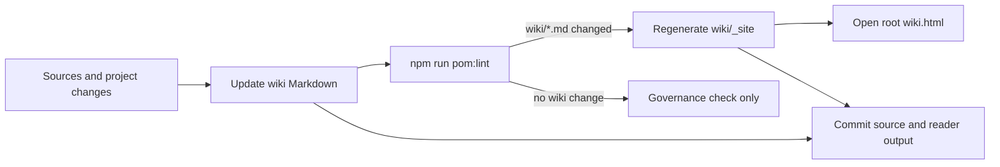

# Persistent Wiki Method

## Summary

The Persistent Wiki is POM's maintained synthesis of reusable project knowledge. It is the place where repeated understanding can accumulate, without becoming a temporary RAG index, a scratchpad, or a document dump.

## Current State

POM's wiki model is inspired by Andrej Karpathy's LLM Wiki pattern. POM keeps a local reference copy in `WIKI_METHOD.md` and adapts the pattern into reusable skills, prompts, templates, and lint guidance.

The active wiki workflows are exposed through `skills/wiki.md`. They treat the wiki as a maintained Memory Element, not as prose that is written once and left to age:

- `build`: initial wiki creation.
- `stale`: find pages that may be outdated after source changes.
- `query`: answer from the wiki and optionally archive reusable answers.
- `lint`: health-check links, orphans, weak sources, stale candidates, and open questions.

## Details

The wiki layer sits between raw sources and question-answering. The agent should not rediscover the project from scratch on every question. Instead, it should read the index, drill into relevant pages, distinguish facts from inferences, and propose archival when an answer has durable value.

The two special wiki files have distinct roles:

| File | Role |
|---|---|
| `wiki/index.md` | Content map for navigation and page discovery. |
| `wiki/log.md` | Chronological register of wiki changes. It is maintained as source memory but excluded from the generated reader. |

POM now also supports generated HTML reader output. That reader output should make the wiki easier to read, but it remains derived from Markdown, not a second memory source.

## Wiki Reader Lifecycle

The wiki lifecycle starts from source authority and ends with a regenerated reader. Markdown remains the maintained memory; HTML is the static view generated from it.

The lint-triggered render is intentionally conditional. `pom:lint` uses Git status to detect changed Markdown pages under `wiki/`. If it finds any, it runs the static renderer after governance checks pass. If no wiki Markdown changed, lint does not regenerate the reader.

Use `npm run pom:wiki:render` for an explicit refresh, for example after changing the reader script or theme. Open `wiki.html` from the project root when a human needs the generated reader.

## Sources

| Source | Use |
|---|---|
| `WIKI_METHOD.md` | Conceptual architecture: raw sources, wiki, schema, ingest, query, lint, index, and log. |
| `README.md` | Persistent Wiki lifecycle and reader generation rules. |
| `skills/wiki.md` | POM skill modes and key rules. |
| `prompts/10-build-wiki.md` | Batch-oriented initial wiki creation. |
| `prompts/13-query-wiki.md` | Query workflow and optional archival of useful answers. |
| `prompts/14-lint-wiki.md` | Lightweight wiki health report. |
| `scripts/lint-doc-governance.ts` | Conditional reader regeneration after wiki Markdown changes. |
| `scripts/render-wiki.mjs` | Static wiki reader generation. |
| `templates/WIKI_INDEX_TEMPLATE.md` | Shape of a wiki index. |
| `templates/WIKI_LOG_TEMPLATE.md` | Shape of a wiki log. |
| `templates/WIKI_PAGE_TEMPLATE.md` | Shape of a generic page. |

## Linked Decisions

| Decision | Impact |
|---|---|
| SPEC-0000 R1 | POM must be able to maintain a persistent wiki rather than a volatile index. |
| SPEC-0000 R6 | Memory must stay alive through stale review, reconciliation, and orphan detection. |

## Open Questions

| Question | Status |
|---|---|
| Should reader generation become a wiki skill mode or remain a script command? | Open; the stable command is `npm run pom:wiki:render`. |
| Should the reader preserve the exact Markdown section shape or add semantic cards? | Open; the current renderer uses conservative Markdown rendering. |

## Related Links

- [[operating-memory]]
- [[skills-and-prompts]]
- [[templates-and-governance]]
